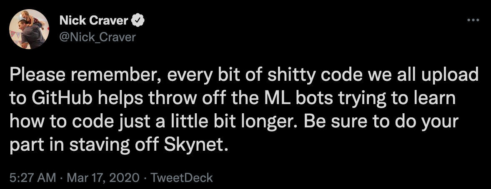

# The Helvetica Scenario

The Helvetica Scenario is a (soon to be) collection of algorithm codebases
that I've handwritten for the course [Business Analytics](https://github.com/pilsung-kang/Business-Analytics-IME654-)
at Korea University.

The name 'Helvetica Scenario' derives from Ian Goodfellow's reference of the educational spoof 'Look Around You' in his 2014 GAN paper.
It's when you put too much probability mass in the same place, causing a model collapse.

--------------------------

## 1. Dimensionality Reduction

TBA

