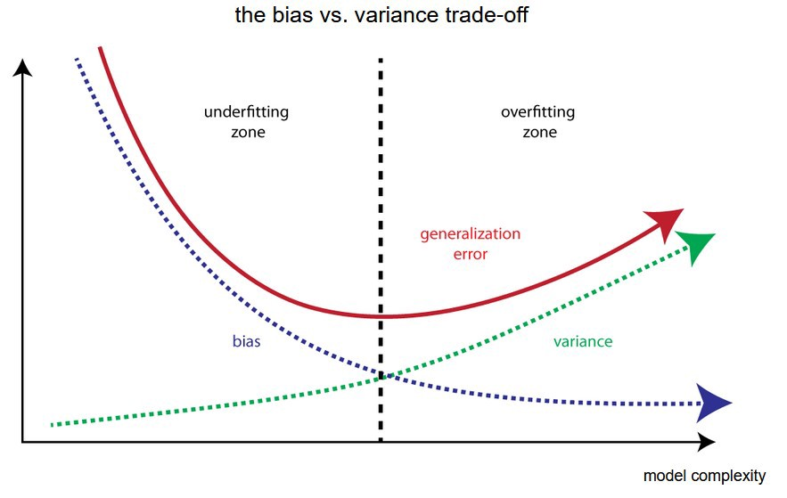

# Ensemble Learning

## Contents
- [Bias-Variance Decomposition](#bias-variance-decomposition)
    - [Mathematical Definition](#mathematical-definition)
    - [Decomposition of Expected Test Error](#decomposition-of-expected-test-error-given)
- [Ensembles](#ensembles)
- [Bootstrap Aggregating (Bagging)](#bootstrap-aggregating-bagging)
    - [Bootstraps](#bootstraps)
    - [Result Aggregating](#result-aggregating)
- [Random Forests](#random-forests)
    - [Variable Importance: OOB](#variable-importance-oob)
- [Adaptive Boosting (AdaBoost)](#adaptive-boosting-adaboost)
    - [AdaBoost Algorithm](#adaboost-algorithm)
- [Gradient Boosting Machine (GBM)](#gradient-boosting-machine-gbm)
    - [The Gradient](#the-gradient)
    - [Variable Importance](#variable-importance)

The Datasets used for this tutorial can be found here:

- [Bank Personal Loan Modelling](https://www.kaggle.com/datasets/teertha/personal-loan-modeling)

- [Pumpkin Seeds Dataset](https://www.kaggle.com/datasets/muratkokludataset/pumpkin-seeds-dataset?datasetId=2033872&sortBy=voteCount)

- [Boston House Price Dataset](https://scikit-learn.org/stable/modules/generated/sklearn.datasets.load_boston.html)

--------------

## Bias-Variance Decomposition

Bias-Variance Decomposition 은 모델의 일반화 성능을 높히기 위한 정규화 방법론들과 앙상블 방법론들의 이론적 배경이다. 실제 데이터로 학습되는 모든 모델은 어느정도의 Bias-Variance tradeoff 가 존재하기 때문에, 수리적 배경을 이해하여 모델의 성능을 높히기 위한 적절한 조치를 취해줘야 한다.

<p align="center">
    
</p>

**Error Due to Bias:** 모델의 Expected prediction 과 실제 값의 차이다. 모델의 Expected prediction 이란, 같은 분포에서 나온 많은 데이터셋을 통해 많은 모델을 학습시켰을 때 해당 모델들의 평균 예측치다.

**Error Due to Variance:** 같은 분포에서 나온 많은 데이터셋을 통해 모델을 학습시켰을 때, 한 데이터포인트에 대한 전체 평균 예측치와 개별 모델의 예측치의 차이를 의미한다. 즉, 전체 모델들간의 예측치의 차이로 해석할 수 있다.

Bias 는 모델들의 전반적인 성능이 좋은지 나쁜지를 의미하고, Variance 는 각 모델들이 서로와 얼마나 다른지를 의미한다. 머신러닝의 대부분의 모델은 둘중 하나가 높다는 특징을 가지고 있기 때문에 Bias-Variance Tradeoff 라고 불린다.

특정 모델을 학습시켰을 때 test error 는 필연적으로 등장한다. Bias-Variance Decomposition 은 해당 error 가 Bias 에서 온 error 인지, variance 에서 온 error 인지, noise 에서 온 error 인지 평가해 줄 수 있다.

### Mathematical Definition

> 해당 Tutorial 의 Mathematical Definition 파트는 [Cornell CS4780 SP17](https://www.youtube.com/watch?v=zUJbRO0Wavo) Killian Weinberger 교수님의 강의를 참고하였습니다.

$P(X,Y)$ 라는 분포에서 i.i.d 로 데이터셋 $D = \{(\mathbf{x}_1, y_1), \dots, (\mathbf{x}_n,y_n)\}$ 를 추출했다고 가정하자. Regression 모델을 가정했을 때, 모든 벡터 $\mathbf{x_n}$ 에 대한 정답 라벨 $y_n$ 은 unique 하지 않고, 분포에 따라 주어진다.

> 영상에서 이 부분에 대해 갸우뚱하는 학생들을 위해 교수님이 직접 예시를 들어준다. 집에 대한 가격을 나타내는 데이터셋에 대해, 설명변수의 값이 모두 동일한 두개의 집은 무조건적으로 가격이 같지 않다.

**Expected Label:**

$$
\bar{y}(\mathbf{x}) = E_{y \vert \mathbf{x}} \left[Y\right] = \int\limits_y y \, \Pr(y \vert \mathbf{x}) \partial y
$$

i.i.d 로 추출한 수많은 데이터셋들에 대해 모델을 학습시킨 뒤, 새로운 샘플 $\mathbf{x}$ 에 대한 expected label 은 위와 같이 계산할 수 있다. 데이터셋 자체를 $P(X,Y)$ 라는 분포에서 i.i.d 추출했기 때문에 random variable 로 취급할 수 있으므로, continuous r.v. 의 Expectation 을 구하는 것과 동일하게 $y$ 값과 모델의 예측치들에 대해 $y$ 로 미분해주면 된다.

**Expected Test Error (given $h_D$):**

$$
E_{(\mathbf{x},y) \sim P} \left[ \left(h_D (\mathbf{x}) - y \right)^2 \right] = \int\limits_x \! \! \int\limits_y \left( h_D(\mathbf{x}) - y\right)^2 \Pr(\mathbf{x},y) \partial y \partial \mathbf{x}.
$$

$D$ 라는 학습 데이터를 통해 알고리즘 $\mathcal{A}$ 를 학습시켰다고 가정하자 ($h_D = \mathcal{A}(D)$).  그렇다면 해당 모델 $h_D$ 의 Expected Test Error 은 (예시가 regression 이기 때문에 squared loss 사용) 위와 같이 구할 수 있다. $D$ 는 앞서 설명했듯이 random variable 로 취급할 수 있고, $h_D$ 는 $D$ 에 대한 function 이기 때문에 마찬가지로 random variable 이다.

**Expected Classifier (given $\mathcal{A}$):**

$$
\bar{h} = E_{D \sim P^n} \left[ h_D \right] = \int\limits_D h_D \Pr(D) \partial D
$$

**$h_D$ 와 $\mathcal{A}$ 를 구분짓는게 핵심이다.** $h_D$ 는 하나의 모델이고 $\mathcal{A}$ 는 학습될 수 있는 모든 모델이다. 그렇기 때문에 위와 같이 expected classifer 은 분포 $P$ 에서 추출된 $D$ 로 학습된 모든 모델의 expectation 이라고 할 수 있다.

**Expected Test Error (given $\mathcal{A}$):**

$$
\begin{equation*}
E_{\substack{(\mathbf{x},y) \sim P\\ D \sim P^n}} \left[\left(h_{D}(\mathbf{x}) - y\right)^{2}\right] = \int_{D} \int_{\mathbf{x}} \int_{y} \left( h_{D}(\mathbf{x}) - y\right)^{2} \mathrm{P}(\mathbf{x},y) \mathrm{P}(D) \partial \mathbf{x} \partial y \partial D
\end{equation*}
$$

모든 모델에 대한 expectation 을 구했기 때문에 이제 **가능한 모든 모델에 대한 expected error 을 표현 할 수 있다.** 우리의 목적은 $P(X,Y)$ 에서 추출된 $D$ 로 학습된 모델 $\mathcal{A}$ 의 expected 성능을 구하는 것이기 때문에, 위 식이 이를 나타낸다. 이때 해당 식을 decompose 하면 정확히 어떻게 모델의 에러가 구성되어있는지 볼 수 있다.

### Decomposition of Expected Test Error (given $\mathcal{A}$)

$$
E_{\mathbf{x},y,D}\left[\left[h_{D}(\mathbf{x}) - y\right]^{2}\right]
$$

$$
= E_{\mathbf{x},y,D}\left[\left[\left(h_{D}(\mathbf{x}) - \bar{h}(\mathbf{x})\right) + \left(\bar{h}(\mathbf{x}) - y\right)\right]^{2}\right]
$$

$$
= E_{\mathbf{x}, D}\left[(\bar{h}_{D}(\mathbf{x}) - \bar{h}(\mathbf{x}))^{2}\right]
$$

$$
+2 \mathrm{\;} E_{\mathbf{x}, y, D} \left[\left(h_{D}(\mathbf{x}) - \bar{h}(\mathbf{x})\right)\left(\bar{h}(\mathbf{x}) - y\right)\right] 
$$

$$
+E_{\mathbf{x}, y} \left[\left(\bar{h}(\mathbf{x}) - y\right)^{2}\right]
$$

첫 식은 위에서 구한 Expected Test Error 이다. 이때 expectation 안에 모델의 label 의 expectation $\bar{h}(\mathbf{x})$ 를 한번씩 빼주고 더해준다. 이를 binomial expansion 을 통해 마지막 식처럼 표현 할 수 있다. 복잡해 보이지만 결국 $(a+b)^2 = a^2+2ab+b^2$ 의 꼴이다. 이때 식의 $2ab$ 부분은 0이 된다.

$$
E_{\mathbf{x}, y, D} \left[ \left( h_{D}(\mathbf{x}) - y \right)^{2} \right] = \underbrace{E_{\mathbf{x}, D} \left[ \left(h_{D}(\mathbf{x}) - \bar{h}(\mathbf{x}) \right)^{2} \right]}_\mathrm{Variance} + E_{\mathbf{x}, y}\left[ \left( \bar{h}(\mathbf{x}) - y \right)^{2} \right]
$$

Variance 의 정의 자체가 해당 객체가 평균에서 얼마나 분산되어있는지 이기 때문에, 식의 첫번째 부분을 Variance 라고 할 수 있다. 식의 두번째 부분은 처음에 진행 한 것 처럼 binomial expansion 꼴로 표현하면 아래와 같아진다.

$$
E_{\mathbf{x}, y} \left[ \left(\bar{h}(\mathbf{x}) - y \right)^{2}\right] = E_{\mathbf{x}, y} \left[ \left(\bar{h}(\mathbf{x}) -\bar y(\mathbf{x}) )+(\bar y(\mathbf{x}) - y \right)^{2}\right]
$$

$$
=\underbrace{E_{\mathbf{x}, y} \left[\left(\bar{y}(\mathbf{x}) - y\right)^{2}\right]}_\mathrm{Noise} + \underbrace{E_{\mathbf{x}} \left[\left(\bar{h}(\mathbf{x}) - \bar{y}(\mathbf{x})\right)^{2}\right]}_\mathrm{Bias^2}
$$

$$
+ 2 \mathrm{\;} E_{\mathbf{x}, y} \left[ \left(\bar{h}(\mathbf{x}) - \bar{y}(\mathbf{x})\right)\left(\bar{y}(\mathbf{x}) - y\right)\right] 
$$

동일하게 $2ab$ 부분은 사라지기 때문에, 최종적으로 expected test error 의 decomposition 은 다음과 같아진다:

$$
\underbrace{E_{\mathbf{x}, y, D} \left[\left(h_{D}(\mathbf{x}) - y\right)^{2}\right]}_\mathrm{Expected\;Test\;Error}
$$

$$
= \underbrace{E_{\mathbf{x}, D}\left[\left(h_{D}(\mathbf{x}) - \bar{h}(\mathbf{x})\right)^{2}\right]}_\mathrm{Variance} + \underbrace{E_{\mathbf{x}, y}\left[\left(\bar{y}(\mathbf{x}) - y\right)^{2}\right]}_\mathrm{Noise} + \underbrace{E_{\mathbf{x}}\left[\left(\bar{h}(\mathbf{x}) - \bar{y}(\mathbf{x})\right)^{2}\right]}_\mathrm{Bias^2}
$$

**즉, Bias-Variance decomposition 은 한 머신러닝 알고리즘의 expected test error (혹은 성능) 은 3개의 요인으로 나누어 설명할 수 있음을 의미한다. 한개의 모델이 다른 모델들과 얼마나 다른지를 설명하는 Variance, 전체 모델들의 평균 예측치와 실제값들의 평균의 차를 나타내는 Bias (평균 성능이라고 봐도 무방하다), 그리고 설명할 수 없는 data intrinsic 한 noise 의 합으로 하나의 모델의 성능을 나타낼 수 있다.**

이상적인 알고리즘은 Bias 와 Variance 가 낮지만, 현실적으로 tradeoff 가 발생하기 때문에 필연적으로 둘중 하나는 크다. 보통 Model Compexity 가 낮은 알고리즘들 (ex. LogReg, LDA) 는 High Bias Low Variance 이며, Model Complexity 가 높은 알고리즘들 (ex. NN, Full DT, SVM) 은 Low Bias High Variance 이다.

<p align="center">
    
</p>

위의 그래프를 보면 Model complexity 가 높을수록 높은 Variance 를 가졌다는 의미가 와닿는다. Training sample 에 대한 에러율은 0에 수렴하지만, 같은 분포에서 추출한 또다른 데이터셋인 testing sample 에 대한 에러는 굉장히 높다. 이는 데이터셋의 작은 변화에도 모델이 민감하게 반응한다는 것을 의미하며, 자주 접하는 과적합이 해당 모델들의 고질적인 문제를 표현한다.


-------------------

## Ensembles


```python
import numpy as np
import pandas as pd
import matplotlib.pyplot as plt
import seaborn as sns
import random
from sklearn.datasets import load_diabetes, load_boston
from sklearn.preprocessing import StandardScaler
from sklearn.linear_model import LogisticRegression
from sklearn.svm import SVC
from sklearn.tree import DecisionTreeClassifier, plot_tree
from sklearn.ensemble import BaggingClassifier, RandomForestClassifier, AdaBoostClassifier, GradientBoostingClassifier,GradientBoostingRegressor
from sklearn.metrics import accuracy_score, mean_squared_error
from sklearn.model_selection import RandomizedSearchCV, train_test_split

import warnings
warnings.filterwarnings('ignore')
```


이상적인 모델은 Bias 와 Variance 가 낮아야 하지만, 모델의 complexity 에 따라 현실적으론 Bias-Variance Tradeoff 에 의해 둘 중 하나는 필연적으로 높다.

이를 해결하기 위해 등장한 방법론들의 모음을 **Ensemble** 이라고 하는데, 이름에서 알 수 있듯이 개별적으로 어느정도의 성능을 내는 여러개의 모델을 합쳐 최종적인 성능을 끌어올리는 방법론들이다. 앙상블 방법론들은 수행하고자 하는 task 로 인해 크개 두가지 갈래로 나눌 수 있다:

- Bagging: Decreases Variance

- Boosting: Decreases Bias

--------------------

## Bootstrap Aggregating (Bagging)

### Bootstraps


```python
x = [f'x_{i}' for i in range(1, 11)]
y = [f'y_{i}' for i in range(1, 11)]
df = pd.DataFrame({'Original': x, 'Data': y})
b1 = df.sample(frac=1, replace=True).reset_index(drop=True)
b1.columns=['Bootstrap','1']
b2 = df.sample(frac=1, replace=True).reset_index(drop=True)
b2.columns=['Bootstrap','2']
pd.concat([df, b1, b2], axis=1)
```


<table border="1" class="dataframe">
  <thead>
    <tr style="text-align: right;">
      <th></th>
      <th>Original</th>
      <th>Data</th>
      <th>Bootstrap</th>
      <th>1</th>
      <th>Bootstrap</th>
      <th>2</th>
    </tr>
  </thead>
  <tbody>
    <tr>
      <th>0</th>
      <td>x_1</td>
      <td>y_1</td>
      <td>x_8</td>
      <td>y_8</td>
      <td>x_2</td>
      <td>y_2</td>
    </tr>
    <tr>
      <th>1</th>
      <td>x_2</td>
      <td>y_2</td>
      <td>x_10</td>
      <td>y_10</td>
      <td>x_1</td>
      <td>y_1</td>
    </tr>
    <tr>
      <th>2</th>
      <td>x_3</td>
      <td>y_3</td>
      <td>x_8</td>
      <td>y_8</td>
      <td>x_5</td>
      <td>y_5</td>
    </tr>
    <tr>
      <th>3</th>
      <td>x_4</td>
      <td>y_4</td>
      <td>x_4</td>
      <td>y_4</td>
      <td>x_7</td>
      <td>y_7</td>
    </tr>
    <tr>
      <th>4</th>
      <td>x_5</td>
      <td>y_5</td>
      <td>x_3</td>
      <td>y_3</td>
      <td>x_2</td>
      <td>y_2</td>
    </tr>
    <tr>
      <th>5</th>
      <td>x_6</td>
      <td>y_6</td>
      <td>x_8</td>
      <td>y_8</td>
      <td>x_9</td>
      <td>y_9</td>
    </tr>
    <tr>
      <th>6</th>
      <td>x_7</td>
      <td>y_7</td>
      <td>x_5</td>
      <td>y_5</td>
      <td>x_2</td>
      <td>y_2</td>
    </tr>
    <tr>
      <th>7</th>
      <td>x_8</td>
      <td>y_8</td>
      <td>x_4</td>
      <td>y_4</td>
      <td>x_7</td>
      <td>y_7</td>
    </tr>
    <tr>
      <th>8</th>
      <td>x_9</td>
      <td>y_9</td>
      <td>x_9</td>
      <td>y_9</td>
      <td>x_4</td>
      <td>y_4</td>
    </tr>
    <tr>
      <th>9</th>
      <td>x_10</td>
      <td>y_10</td>
      <td>x_5</td>
      <td>y_5</td>
      <td>x_3</td>
      <td>y_3</td>
    </tr>
  </tbody>
</table>
</div>


Bagging 은 특정 모델의 분산을 낮춰주는 학습 방법론이다. 위 테이블을 예시로 기존 데이터셋은 10개의 샘플을 가지고 있다. 이때 기존 데이터셋에서 10개의 샘플을 random 으로 복원추출을 하여 $B$ 개의 새로운 데이터셋, 즉 Bootstrap 을 생성한다.

해당 Bootstrap 들로 동일한 알고리즘을 학습 한 뒤, 결과를 하나로 합치는 것이 Bagging 의 핵심이다. 이때 알고리즘은 지도학습 알고리즘이면 어떤 것을 사용해도 무방하지만, **Bagging 은 앞서 언급하였듯이 high model complexity 를 가진 알고리즘들에 효과적이다.** Bagging 자체는 알고리즘이 아니라 앙상블의 다양성을 확보하기 위한 방법론 중 하나이기 때문에, 어떤 알고리즘을 사용하냐에 따라 Bagging with Neural Networks, Bagging with SVM 등으로 불리는 명칭이 달라진다.


```python
df = pd.read_csv('Bank_Personal_Loan_Modelling.csv')
X = df.drop('Personal Loan', axis=1)
y = df['Personal Loan']
X
```


<table border="1" class="dataframe">
  <thead>
    <tr style="text-align: right;">
      <th></th>
      <th>ID</th>
      <th>Age</th>
      <th>Experience</th>
      <th>Income</th>
      <th>ZIP Code</th>
      <th>Family</th>
      <th>CCAvg</th>
      <th>Education</th>
      <th>Mortgage</th>
      <th>Securities Account</th>
      <th>CD Account</th>
      <th>Online</th>
      <th>CreditCard</th>
    </tr>
  </thead>
  <tbody>
    <tr>
      <th>0</th>
      <td>1</td>
      <td>25</td>
      <td>1</td>
      <td>49</td>
      <td>91107</td>
      <td>4</td>
      <td>1.6</td>
      <td>1</td>
      <td>0</td>
      <td>1</td>
      <td>0</td>
      <td>0</td>
      <td>0</td>
    </tr>
    <tr>
      <th>1</th>
      <td>2</td>
      <td>45</td>
      <td>19</td>
      <td>34</td>
      <td>90089</td>
      <td>3</td>
      <td>1.5</td>
      <td>1</td>
      <td>0</td>
      <td>1</td>
      <td>0</td>
      <td>0</td>
      <td>0</td>
    </tr>
    <tr>
      <th>2</th>
      <td>3</td>
      <td>39</td>
      <td>15</td>
      <td>11</td>
      <td>94720</td>
      <td>1</td>
      <td>1.0</td>
      <td>1</td>
      <td>0</td>
      <td>0</td>
      <td>0</td>
      <td>0</td>
      <td>0</td>
    </tr>
    <tr>
      <th>3</th>
      <td>4</td>
      <td>35</td>
      <td>9</td>
      <td>100</td>
      <td>94112</td>
      <td>1</td>
      <td>2.7</td>
      <td>2</td>
      <td>0</td>
      <td>0</td>
      <td>0</td>
      <td>0</td>
      <td>0</td>
    </tr>
    <tr>
      <th>4</th>
      <td>5</td>
      <td>35</td>
      <td>8</td>
      <td>45</td>
      <td>91330</td>
      <td>4</td>
      <td>1.0</td>
      <td>2</td>
      <td>0</td>
      <td>0</td>
      <td>0</td>
      <td>0</td>
      <td>1</td>
    </tr>
    <tr>
      <th>...</th>
      <td>...</td>
      <td>...</td>
      <td>...</td>
      <td>...</td>
      <td>...</td>
      <td>...</td>
      <td>...</td>
      <td>...</td>
      <td>...</td>
      <td>...</td>
      <td>...</td>
      <td>...</td>
      <td>...</td>
    </tr>
    <tr>
      <th>4995</th>
      <td>4996</td>
      <td>29</td>
      <td>3</td>
      <td>40</td>
      <td>92697</td>
      <td>1</td>
      <td>1.9</td>
      <td>3</td>
      <td>0</td>
      <td>0</td>
      <td>0</td>
      <td>1</td>
      <td>0</td>
    </tr>
    <tr>
      <th>4996</th>
      <td>4997</td>
      <td>30</td>
      <td>4</td>
      <td>15</td>
      <td>92037</td>
      <td>4</td>
      <td>0.4</td>
      <td>1</td>
      <td>85</td>
      <td>0</td>
      <td>0</td>
      <td>1</td>
      <td>0</td>
    </tr>
    <tr>
      <th>4997</th>
      <td>4998</td>
      <td>63</td>
      <td>39</td>
      <td>24</td>
      <td>93023</td>
      <td>2</td>
      <td>0.3</td>
      <td>3</td>
      <td>0</td>
      <td>0</td>
      <td>0</td>
      <td>0</td>
      <td>0</td>
    </tr>
    <tr>
      <th>4998</th>
      <td>4999</td>
      <td>65</td>
      <td>40</td>
      <td>49</td>
      <td>90034</td>
      <td>3</td>
      <td>0.5</td>
      <td>2</td>
      <td>0</td>
      <td>0</td>
      <td>0</td>
      <td>1</td>
      <td>0</td>
    </tr>
    <tr>
      <th>4999</th>
      <td>5000</td>
      <td>28</td>
      <td>4</td>
      <td>83</td>
      <td>92612</td>
      <td>3</td>
      <td>0.8</td>
      <td>1</td>
      <td>0</td>
      <td>0</td>
      <td>0</td>
      <td>1</td>
      <td>1</td>
    </tr>
  </tbody>
</table>
<p>5000 rows × 13 columns</p>
</div>


사용한 데이터셋은 [Bank Personal Loan Modelling](https://www.kaggle.com/datasets/teertha/personal-loan-modeling) 으로, 총 13개의 설명변수로 해당 고객이 제시된 대출상품을 수락했는지 거절했는지 분류하는 binary classification task 에 사용되는 대표적인 toy dataset 이다.


```python
X_train, X_test, y_train, y_test = train_test_split(X, y, test_size=0.2, random_state=42)
base_model = LogisticRegression()
base_model.fit(X_train, y_train)

n_estimators = 15
ensemble = BaggingClassifier(base_estimator=LogisticRegression(),
            n_estimators=n_estimators,
            bootstrap=True,
            random_state=42)
ensemble.fit(X_train, y_train)
ensemble.score(X_test, y_test)

print(f'Test accuracy of a single Logistic regression model: {base_model.score(X_test, y_test)}')
print(f'Test accuracy of a Bagging ensemble of {n_estimators} Logistic regression models: {ensemble.score(X_test, y_test)}')

```

    Test accuracy of a single Logistic regression model: 0.908
    Test accuracy of a Bagging ensemble of 15 Logistic regression models: 0.913


결과에서 확인 할 수 있듯이 단일 모델보다 20개의 모델의 앙상블을 사용했을 시 Test accuracy 가 증가한다. 그렇다면 Bagging Ensemble 에서 20개의 모델을 합치는 방법론인 Result Aggregating 을 알아보자.

### Result Aggregating

$B$ 개의 Bootstrap 으로 $B$ 개의 모델을 학습시켰다면, 최종적으로 이 모델들을 하나로 합쳐야 한다. Bagging 에서 이 단계를 Result Aggregating 이라 하며, 다양한 방법론들이 있다.

#### Majority Voting

각 모델의 결과를 합치는 방법론 중 가장 간단한 방법론인 Majority Voting 은, 과반수의 예측값을 최종 예측값으로 선택하는 것이다.

$$
\hat y_{Ensemble}=argmax(\sum_{j=1}^n\delta(\hat y_j=i), \ i \in \{0,1\})
$$


```python
test_sample_index = X_test.sample(n=1).index.item()
test_sample = X_test.loc[test_sample_index].to_numpy().reshape(1, -1)
test_sample_y = y_test.loc[test_sample_index]

model_name=[]
model_score=[]
test_sample_prob=[]
predicted_label=[]
for i, model in enumerate(ensemble.estimators_):
    model_name.append(f'Model {i+1}')
    model_score.append(model.score(X_test, y_test))
    test_sample_prob.append(model.predict_proba(test_sample)[0][1])
    predicted_label.append(model.predict(test_sample)[0])

maj_vote = pd.DataFrame({'Ensemble Population':
                            model_name,     
                        'Test Accuracy':
                            model_score,
                        'P(y=1) for a test sample':
                            test_sample_prob,
                        'Predicted Label':
                            predicted_label})
maj_vote
```


<table border="1" class="dataframe">
  <thead>
    <tr style="text-align: right;">
      <th></th>
      <th>Ensemble Population</th>
      <th>Test Accuracy</th>
      <th>P(y=1) for a test sample</th>
      <th>Predicted Label</th>
    </tr>
  </thead>
  <tbody>
    <tr>
      <th>0</th>
      <td>Model 1</td>
      <td>0.908</td>
      <td>0.140973</td>
      <td>0</td>
    </tr>
    <tr>
      <th>1</th>
      <td>Model 2</td>
      <td>0.910</td>
      <td>0.149015</td>
      <td>0</td>
    </tr>
    <tr>
      <th>2</th>
      <td>Model 3</td>
      <td>0.907</td>
      <td>0.124695</td>
      <td>0</td>
    </tr>
    <tr>
      <th>3</th>
      <td>Model 4</td>
      <td>0.907</td>
      <td>0.163355</td>
      <td>0</td>
    </tr>
    <tr>
      <th>4</th>
      <td>Model 5</td>
      <td>0.909</td>
      <td>0.144366</td>
      <td>0</td>
    </tr>
    <tr>
      <th>5</th>
      <td>Model 6</td>
      <td>0.908</td>
      <td>0.196135</td>
      <td>0</td>
    </tr>
    <tr>
      <th>6</th>
      <td>Model 7</td>
      <td>0.909</td>
      <td>0.118339</td>
      <td>0</td>
    </tr>
    <tr>
      <th>7</th>
      <td>Model 8</td>
      <td>0.910</td>
      <td>0.122437</td>
      <td>0</td>
    </tr>
    <tr>
      <th>8</th>
      <td>Model 9</td>
      <td>0.903</td>
      <td>0.151069</td>
      <td>0</td>
    </tr>
    <tr>
      <th>9</th>
      <td>Model 10</td>
      <td>0.912</td>
      <td>0.163708</td>
      <td>0</td>
    </tr>
    <tr>
      <th>10</th>
      <td>Model 11</td>
      <td>0.907</td>
      <td>0.210730</td>
      <td>0</td>
    </tr>
    <tr>
      <th>11</th>
      <td>Model 12</td>
      <td>0.945</td>
      <td>0.072664</td>
      <td>0</td>
    </tr>
    <tr>
      <th>12</th>
      <td>Model 13</td>
      <td>0.906</td>
      <td>0.145764</td>
      <td>0</td>
    </tr>
    <tr>
      <th>13</th>
      <td>Model 14</td>
      <td>0.909</td>
      <td>0.122003</td>
      <td>0</td>
    </tr>
    <tr>
      <th>14</th>
      <td>Model 15</td>
      <td>0.908</td>
      <td>0.147521</td>
      <td>0</td>
    </tr>
  </tbody>
</table>
</div>


각 모델은 새로 들어온 test sample 에 대해 class 1 에 포함될 확률과, 0.5 로 설정된 cutoff 로 sample 에 대한 최종 예측 class 를 보여준다. 이때 Majority Voting 은 단순히 15개의 모델 모두 샘플이 class 0 이라고 예측하였기 때문에, 해당 샘플에 대한 앙상블의 최종 예측값은 0이 된다.

#### Weighted Voting
각 모델의 결과에 가중치를 부여해서 합칠 수 있는데, 가중치를 각 모델의 Test Accuracy 로 설정한 예시는 다음과 같다.

$$
\hat y_{Ensemble}=argmax \left( {\sum_{j=1}^n(TestAcc_j) \cdot \delta(\hat y_j=i) \over \sum_{j=1}^n(TestAcc_j)}, \ i \in \{0,1\} \right)
$$

$$
\delta = \text{Counting function}
$$

각 class 의 Test Accuracy 의 합을 전체 Test Accuracy 의 합으로 나눠줌으로써 정규화를 진행해준다. 높은 Test Accuracy 는 모델의 신뢰도가 높다는 것을 의미하기 때문에, 이를 가중치로 반영한 방법론이다.


```python
test_sum = sum(maj_vote['Test Accuracy'])
test_sum_class_0 = sum(maj_vote.loc[maj_vote['Predicted Label']==0]['Test Accuracy'])
test_sum_class_1 = sum(maj_vote.loc[maj_vote['Predicted Label']==1]['Test Accuracy'])
weighted_vote_class_0 = test_sum_class_0/test_sum
weighted_vote_class_1 = test_sum_class_1/test_sum
print(f'Weighted Vote for Class 0: {weighted_vote_class_0}')
print(f'Weighted Vote for Class 1: {weighted_vote_class_1}')
```

    Weighted Vote for Class 0: 1.0
    Weighted Vote for Class 1: 0.0


----------------

## Random Forests

Bagging 은 굉장히 직관적인 앙상블 기법이다. 복원추출로 동일한 샘플수를 가진 bootstrap 을 생성하고, 모델들을 학습시킨 뒤 적절히 결합하여 complex 한 모델의 분산을 줄인다. High complexity 를 가진 그 어떤 모델에 bagging 을 적용할 수 있고, base learner (기준이 되는 학습 알고리즘) 에 따라 bagging with SVM 등으로 불린다. 반면 Random Forest 는 **의사결정나무에 bagging 을 적용한 모델로,** 특별히 혼자 다르게 불리는 이유는 OOB 데이터셋에 의한 추가적인 insight 도출 능력과 bagging 에 있어 모든 설명변수를 사용하지 않는다는 특징이 있기 때문이다.

<p align="center">
    
</p>

Random Forest 는 기존 Bagging 을 사용하지만, Bootstrap 을 이용한 학습 단계에서 모든 설명변수를 사용하지 않고 random 한 설명변수의 subset 만으로 학습을 진행한다는 특징을 가지고 있다. 이러한 과정으로 통해 Random Forest 는 Bagging 으로 다양성 확보를 하고, 설명변수를 random 하게 추출함으로써 다양성을 추가적으로 더 확보할 수 있다.

예시로 사용할 데이터셋은 [Pumpkin Seeds Dataset](https://www.kaggle.com/datasets/muratkokludataset/pumpkin-seeds-dataset?datasetId=2033872&sortBy=voteCount) 으로, 총 12개의 설명변수로 pumpkin seed 의 종류를 분류하는 binary classification task 에 사용되는 dataset 이다.


```python
df = pd.read_excel('Pumpkin_Seeds_Dataset.xlsx')
df = df.replace({'Çerçevelik': 0, 'Ürgüp Sivrisi': 1})
X = df.drop('Class', axis=1)
y = df['Class']
X
```


<table border="1" class="dataframe">
  <thead>
    <tr style="text-align: right;">
      <th></th>
      <th>Area</th>
      <th>Perimeter</th>
      <th>Major_Axis_Length</th>
      <th>Minor_Axis_Length</th>
      <th>Convex_Area</th>
      <th>Equiv_Diameter</th>
      <th>Eccentricity</th>
      <th>Solidity</th>
      <th>Extent</th>
      <th>Roundness</th>
      <th>Aspect_Ration</th>
      <th>Compactness</th>
    </tr>
  </thead>
  <tbody>
    <tr>
      <th>0</th>
      <td>56276</td>
      <td>888.242</td>
      <td>326.1485</td>
      <td>220.2388</td>
      <td>56831</td>
      <td>267.6805</td>
      <td>0.7376</td>
      <td>0.9902</td>
      <td>0.7453</td>
      <td>0.8963</td>
      <td>1.4809</td>
      <td>0.8207</td>
    </tr>
    <tr>
      <th>1</th>
      <td>76631</td>
      <td>1068.146</td>
      <td>417.1932</td>
      <td>234.2289</td>
      <td>77280</td>
      <td>312.3614</td>
      <td>0.8275</td>
      <td>0.9916</td>
      <td>0.7151</td>
      <td>0.8440</td>
      <td>1.7811</td>
      <td>0.7487</td>
    </tr>
    <tr>
      <th>2</th>
      <td>71623</td>
      <td>1082.987</td>
      <td>435.8328</td>
      <td>211.0457</td>
      <td>72663</td>
      <td>301.9822</td>
      <td>0.8749</td>
      <td>0.9857</td>
      <td>0.7400</td>
      <td>0.7674</td>
      <td>2.0651</td>
      <td>0.6929</td>
    </tr>
    <tr>
      <th>3</th>
      <td>66458</td>
      <td>992.051</td>
      <td>381.5638</td>
      <td>222.5322</td>
      <td>67118</td>
      <td>290.8899</td>
      <td>0.8123</td>
      <td>0.9902</td>
      <td>0.7396</td>
      <td>0.8486</td>
      <td>1.7146</td>
      <td>0.7624</td>
    </tr>
    <tr>
      <th>4</th>
      <td>66107</td>
      <td>998.146</td>
      <td>383.8883</td>
      <td>220.4545</td>
      <td>67117</td>
      <td>290.1207</td>
      <td>0.8187</td>
      <td>0.9850</td>
      <td>0.6752</td>
      <td>0.8338</td>
      <td>1.7413</td>
      <td>0.7557</td>
    </tr>
    <tr>
      <th>...</th>
      <td>...</td>
      <td>...</td>
      <td>...</td>
      <td>...</td>
      <td>...</td>
      <td>...</td>
      <td>...</td>
      <td>...</td>
      <td>...</td>
      <td>...</td>
      <td>...</td>
      <td>...</td>
    </tr>
    <tr>
      <th>2495</th>
      <td>79637</td>
      <td>1224.710</td>
      <td>533.1513</td>
      <td>190.4367</td>
      <td>80381</td>
      <td>318.4289</td>
      <td>0.9340</td>
      <td>0.9907</td>
      <td>0.4888</td>
      <td>0.6672</td>
      <td>2.7996</td>
      <td>0.5973</td>
    </tr>
    <tr>
      <th>2496</th>
      <td>69647</td>
      <td>1084.318</td>
      <td>462.9416</td>
      <td>191.8210</td>
      <td>70216</td>
      <td>297.7874</td>
      <td>0.9101</td>
      <td>0.9919</td>
      <td>0.6002</td>
      <td>0.7444</td>
      <td>2.4134</td>
      <td>0.6433</td>
    </tr>
    <tr>
      <th>2497</th>
      <td>87994</td>
      <td>1210.314</td>
      <td>507.2200</td>
      <td>222.1872</td>
      <td>88702</td>
      <td>334.7199</td>
      <td>0.8990</td>
      <td>0.9920</td>
      <td>0.7643</td>
      <td>0.7549</td>
      <td>2.2828</td>
      <td>0.6599</td>
    </tr>
    <tr>
      <th>2498</th>
      <td>80011</td>
      <td>1182.947</td>
      <td>501.9065</td>
      <td>204.7531</td>
      <td>80902</td>
      <td>319.1758</td>
      <td>0.9130</td>
      <td>0.9890</td>
      <td>0.7374</td>
      <td>0.7185</td>
      <td>2.4513</td>
      <td>0.6359</td>
    </tr>
    <tr>
      <th>2499</th>
      <td>84934</td>
      <td>1159.933</td>
      <td>462.8951</td>
      <td>234.5597</td>
      <td>85781</td>
      <td>328.8485</td>
      <td>0.8621</td>
      <td>0.9901</td>
      <td>0.7360</td>
      <td>0.7933</td>
      <td>1.9735</td>
      <td>0.7104</td>
    </tr>
  </tbody>
</table>
<p>2500 rows × 12 columns</p>
</div>


```python
X_train, X_test, y_train, y_test = train_test_split(X, y, test_size=0.2, random_state=42)
tree = DecisionTreeClassifier(max_depth=5, random_state=0)
tree.fit(X_train, y_train)

n_estimators = 5
rf = RandomForestClassifier(n_estimators=n_estimators, max_depth=5,random_state=0)
rf.fit(X_train, y_train)

n_estimators_random = [i for i in range(1,21)]
max_depth = [i for i in range(1, 11)]
max_depth.append(None)
min_samples_split = [2, 5, 10]
min_samples_leaf = [1, 2, 4]
random_grid = {'n_estimators': n_estimators_random,
               'max_depth': max_depth,
               'min_samples_split': min_samples_split,
               'min_samples_leaf': min_samples_leaf}

rf_base = RandomForestClassifier()
rf_random = RandomizedSearchCV(estimator = rf_base, param_distributions = random_grid, n_iter = 100, cv = 3, verbose=1, random_state=42, n_jobs = -1)
rf_random.fit(X_train, y_train)

best_random = rf_random.best_estimator_
best_random.fit(X_train, y_train)

print(f'Test accuracy of a single Decision Tree model: {tree.score(X_test, y_test)}')
print(f'Test accuracy of a Random Forest ensemble of {n_estimators} Decision Tree models: {rf.score(X_test, y_test)}')
print(f'Test accuracy of a Random Forest ensemble of {n_estimators} Decision Tree models with Randomized Search: {best_random.score(X_test, y_test)}')

print(f'Parameters of the best Random Forest model: \n {rf_random.best_params_}')
```

    Fitting 3 folds for each of 100 candidates, totalling 300 fits
    Test accuracy of a single Decision Tree model: 0.848
    Test accuracy of a Random Forest ensemble of 5 Decision Tree models: 0.856
    Test accuracy of a Random Forest ensemble of 5 Decision Tree models with Randomized Search: 0.864
    Parameters of the best Random Forest model: 
     {'n_estimators': 15, 'min_samples_split': 2, 'min_samples_leaf': 1, 'max_depth': 8}


결과에서 확인 할 수 있듯이 단일 모델보다 Random Forest 를 사용했을 시 Test accuracy 가 증가한다. 추가적으로 Random grid search 를 통해 hyperparameter optimization 진행 시, 더욱 좋은 모델이 학습된다.

### Variable Importance: OOB

앙상블 방법론 중 Bagging 은 각 bootstrap 을 만들때 복원추출을 한다. 그렇기에 bootstrap 수가 아무리 많아도, 확률적으로 단 한번도 bootstrap 에 포함되지 않는 샘플들이 있기 마련이다.

이를 OOB Data (Out-of-bag) 라고 하며, 앙상블의 개별 모델의 Validation Set 으로 쓰인다. 통상적인 머신러닝 모델을 학습시킬 때 데이터셋을 Train/Validation/Test set 으로 나누어 학습을 진행하지만, OOB의 존재 덕분에 따로 Validation Set 을 빼놓지 않고 보다 더 많은 Training sample 을 쓸 수 있다는 장점이 있다.

앙상블 모델중에서 Random Forest 는 실무에서 활용도가 굉장히 높은 모델이다. 바로 OOB Data 로 설명변수의 중요도를 구할 수 있기 때문이다.


```python
sorted_idx = rf.feature_importances_.argsort()
plt.figure(figsize=(10, 7))
plt.barh(X.columns[sorted_idx], rf.feature_importances_[sorted_idx])
plt.xlabel("Random Forest Feature Importance");
```


    

    


**Step 1:** Population (앙상블을 구성하는 개별 모델) 에 대해 OOB error ($e_i$) 를 계산한다.

**Step 2:** 중요도를 구하고자 하는 설명변수 $x_i$ 의 값들에 대해 random permutation 을 진행 후, permutated OOB error ($p_i$) 를 계산한다.

**Step 3:** Population 에 대해 $p_i - e_i$ 의 평균과 분산을 구한 뒤, 변수의 중요도를 산출한다.

이때 Step 2 의 random permutation 은 해당 변수에 대한 sample 의 값을 random 하게 섞는 것을 의미한다. 만약 Random Forest 에서 변수 $x_i$ 의 중요도가 높다면, $p_i - e_i$ 의 값은 커야 하며 편차가 적어야 한다.

$$
d_i^m = p_i^m - e_i^m
\\
\bar d_i = {1\over m}\sum_{i=1}^m d_i^m
\\
s_i^2 = {1 \over m-1} \sum_{i=1}^m (d_i^m - \bar d_i)^2
\\
v_i = {\bar d_i \over s_i}
$$

$d_i^m$ 은 m 번째 tree 에서 설명변수 i 에 대해 permutation 전후 OOB error 의 차이를 나타내고, 이에 따른 평균을 분자로, 분산을 분모로 두어 변수의 중요도 $v_i$ 를 구할 수 있다. 

---------------

## Adaptive Boosting (AdaBoost)

Bagging 은 bootstrap 을 만들어 high model complexity 를 가진 모델을 학습시킨 뒤, 적절히 결합하는 앙상블 방법론이다. **Boosting 은 반대로 하나의 데이터셋에 하나의 모델을 학습시킨 후, 풀어내지 못한 것에 대해 다음단계에서 중점적으로 학습을 반복하는 방법론이다.**

Boosting 에선 Strong vs. Weak model 이란 개념이 등장한다. Classifier 기준으로, Weak model 은 random guessing 보다 성능이 아주 약간 좋은 모델을 의미하며, boosting 은 이런 Weak model 을 기준으로 Strong model 을 향해 나아간다. Boosting 은 데이터셋을 통해 성능이 아주 낮은 weak model 을 먼저 학습시킨 뒤, 오분류한 데이터셋 속 샘플에 대해 가중치를 부여하고 새로운 모델의 학습을 반복한다. 이렇기 때문에 bagging 과는 달리 병렬연산이 불가능하다.

<p align="center">
    
</p>


> Bagging 은 병렬처리가 가능하고, Boosting 은 병렬처리가 불가능하지만 실제로는 Boosting 의 학습이 훨씬 빠른 경우를 종종 볼 수 있다. Bagging 은 애초에 High complexity 를 가진 모델을 병렬 연산하는 것이고, Boosting 은 Weak model 을 직렬연산하는 것이다. 하지만 오히려 Weak model 의 직렬연산이 Bagging 의 high complexity 모델 하나를 학습시키는것보다 빠른 경우가 많다.

Adaptive boosting 은 Boosting 방법론 중 weak model 을 stump tree 로 사용하는 앙상블 방법론이다. Stump tree 란 decision boundary split 을 단 1번만 진행한 Decision tree 를 의미하며, (제대로 학습이 이루어졌다고 가정하면) random guessing 보다 성능이 약간 좋다는 특징을 가진다.

### AdaBoost Algorithm

<p align="center">
    
</p>


1. AdaBoost 의 지정 hyperparameter $T$ 는 individual learner 의 개수를 의미한다. AdaBoost 는 직렬연산을 기반한 알고리즘이기 때문에, individual learner 의 개수는 곧 알고리즘의 iteration 을 의미한다. 보통 50~100개를 지정한다.

2. AdaBoost 의 Input 은 $N$ 개의 정답 pair 을 가진 학습 데이터셋 $S$ 다. 이때 주목할만한 점은 정답라벨 $y_i$ 다. 일반적인 Classification 을 수행하기 위해 데이터셋의 정답라벨은 $0,1$ 의 값을 갖는데 AdaBoost 의 특성상 $-1, 1$ 을 사용한다. 예측하는데 있어 아무런 차이가 없지만, 이렇게 값을 바꾸어 사용하는 이유는 weight update 에서 확인 할 수 있다.


```python
df = pd.read_excel('Pumpkin_Seeds_Dataset.xlsx')
df = df.replace({'Çerçevelik': -1, 'Ürgüp Sivrisi': 1})
df['Class'].value_counts()
```


    -1    1300
     1    1200
    Name: Class, dtype: int64


3. $D_1(i)$ 는 1번째 iteration 에서 sample $i$ 가 선택될 확률분포를 의미한다. **알고리즘 초기엔 일양분포를 사용함으로써 $i$ 가 선택될 확률은 다른 sample 들과 동일하지만, iteration 이 진행되며 이 분포는 바뀐다.**

4. for loop 을 이용해서 individual learner 의 개수만큼 알고리즘을 반복한다.

   4-1. 확률분포 $D_t$ 를 이용하여 모델 $h_t$ 를 학습시킨다. 여기서 주목할 점은 AdaBoost 의 학습용 데이터셋 생성은 Boosting 과 마찬가지로 복원추출을 사용하지만, 첫번째 iteration 에서만 복원추출하는 방식이 Uniform distribution 이기 때문에 random 하다. 이때 $h_t$ 는 Stump tree 를 의미한다.


```python
df_1 = df.sample(frac=1, replace=True, random_state=42)
X_1 = df.drop('Class', axis=1)
y_1 = df['Class']
X_train_1, X_test_1, y_train_1, y_test_1 = train_test_split(X_1, y_1, test_size=0.2, random_state=42)
tree_1 = DecisionTreeClassifier(max_depth=1)
tree_1.fit(X_train_1, y_train_1)
plot_tree(tree_1, feature_names=X_1.columns, class_names=['Çerçevelik', 'Ürgüp Sivrisi'], filled=True);
```


    

    


   4-2. 오분류율인 $\epsilon_t = P_{D_t}(h_t(x)\neq y)$ 을 계산한다.


```python
acc = accuracy_score(y_train_1, tree_1.predict(X_train_1))
err_1 = 1 - acc
err_1
```


    0.12549999999999994


   4-3. 오분류율 $\epsilon_t \geq 0.5$ 면 알고리즘을 종료하고 다시 처음부터 시작한다. 학습한 모델은 weak model 인 stump tree 이기 때문에, 아무리 성능이 낮을지언정 random guessing 보다 성능이 좋아야 한다. 오분류율이 0.5 보다 크거나 같다는 의미는 stump tree 가 random guessing 보다 못했다는 것을 의미하기 때문에, 처음부터 다시 해보라는 일종의 장치를 걸어둔 것이다.

   4-4. $\alpha_t = {1\over2}ln({1-\epsilon_t \over \epsilon_t})$ 를 계산하여 가중치 $\alpha_t$ 를 구한다.


```python
alpha_1 = 0.5 * np.log((1 - err_1) / err_1)
alpha_1
```


    0.9706732679434094


   4-5. $D_{t+1}(i)= {D_t(i)\mathbf{exp}(-\alpha_t y_i h_t (x_i))\over Z_t}$ 를 통해 다음 iteration 의 샘플들이 선택되는 확률분포를 update 한다. **이 부분을 통해 다음 iteration 에서 샘플들이 복원추출로 선택되는 확률이 달라지는 것이다.** $Z_t$ 는 정규화 factor 이다.


```python
d_numerator = np.exp(-alpha_1 * y_train_1 * tree_1.predict(X_train_1))
d_denominator = sum(d_numerator)
d_1 = (d_numerator / d_denominator).to_list()
c = random.choices(range(len(X_train_1)), weights=d_1, k=len(X_train_1))
X_train_2 = X_train_1.iloc[c]
y_train_2 = y_train_1.iloc[c]
X_train_2
```

<table border="1" class="dataframe">
  <thead>
    <tr style="text-align: right;">
      <th></th>
      <th>Area</th>
      <th>Perimeter</th>
      <th>Major_Axis_Length</th>
      <th>Minor_Axis_Length</th>
      <th>Convex_Area</th>
      <th>Equiv_Diameter</th>
      <th>Eccentricity</th>
      <th>Solidity</th>
      <th>Extent</th>
      <th>Roundness</th>
      <th>Aspect_Ration</th>
      <th>Compactness</th>
    </tr>
  </thead>
  <tbody>
    <tr>
      <th>1235</th>
      <td>106188</td>
      <td>1256.137</td>
      <td>477.3815</td>
      <td>285.4023</td>
      <td>107392</td>
      <td>367.6993</td>
      <td>0.8016</td>
      <td>0.9888</td>
      <td>0.7002</td>
      <td>0.8457</td>
      <td>1.6727</td>
      <td>0.7702</td>
    </tr>
    <tr>
      <th>2474</th>
      <td>73111</td>
      <td>1106.783</td>
      <td>466.6600</td>
      <td>200.6157</td>
      <td>73767</td>
      <td>305.1030</td>
      <td>0.9029</td>
      <td>0.9911</td>
      <td>0.6726</td>
      <td>0.7500</td>
      <td>2.3261</td>
      <td>0.6538</td>
    </tr>
    <tr>
      <th>1228</th>
      <td>74188</td>
      <td>1139.758</td>
      <td>471.4994</td>
      <td>203.9162</td>
      <td>75631</td>
      <td>307.3420</td>
      <td>0.9016</td>
      <td>0.9809</td>
      <td>0.6026</td>
      <td>0.7177</td>
      <td>2.3122</td>
      <td>0.6518</td>
    </tr>
    <tr>
      <th>1118</th>
      <td>73284</td>
      <td>1055.042</td>
      <td>410.8323</td>
      <td>227.7399</td>
      <td>73894</td>
      <td>305.4637</td>
      <td>0.8323</td>
      <td>0.9917</td>
      <td>0.7700</td>
      <td>0.8273</td>
      <td>1.8040</td>
      <td>0.7435</td>
    </tr>
    <tr>
      <th>625</th>
      <td>105158</td>
      <td>1271.152</td>
      <td>490.9413</td>
      <td>273.8355</td>
      <td>106080</td>
      <td>365.9116</td>
      <td>0.8300</td>
      <td>0.9913</td>
      <td>0.6976</td>
      <td>0.8178</td>
      <td>1.7928</td>
      <td>0.7453</td>
    </tr>
    <tr>
      <th>...</th>
      <td>...</td>
      <td>...</td>
      <td>...</td>
      <td>...</td>
      <td>...</td>
      <td>...</td>
      <td>...</td>
      <td>...</td>
      <td>...</td>
      <td>...</td>
      <td>...</td>
      <td>...</td>
    </tr>
    <tr>
      <th>2190</th>
      <td>79951</td>
      <td>1214.305</td>
      <td>520.6570</td>
      <td>196.2335</td>
      <td>80756</td>
      <td>319.0561</td>
      <td>0.9263</td>
      <td>0.9900</td>
      <td>0.5136</td>
      <td>0.6814</td>
      <td>2.6533</td>
      <td>0.6128</td>
    </tr>
    <tr>
      <th>808</th>
      <td>84429</td>
      <td>1171.971</td>
      <td>475.0915</td>
      <td>229.3297</td>
      <td>85639</td>
      <td>327.8694</td>
      <td>0.8758</td>
      <td>0.9859</td>
      <td>0.6709</td>
      <td>0.7724</td>
      <td>2.0717</td>
      <td>0.6901</td>
    </tr>
    <tr>
      <th>926</th>
      <td>68712</td>
      <td>1049.409</td>
      <td>427.3806</td>
      <td>205.9922</td>
      <td>69670</td>
      <td>295.7817</td>
      <td>0.8762</td>
      <td>0.9862</td>
      <td>0.6016</td>
      <td>0.7841</td>
      <td>2.0747</td>
      <td>0.6921</td>
    </tr>
    <tr>
      <th>1811</th>
      <td>79991</td>
      <td>1155.524</td>
      <td>481.8270</td>
      <td>212.2153</td>
      <td>80847</td>
      <td>319.1359</td>
      <td>0.8978</td>
      <td>0.9894</td>
      <td>0.7390</td>
      <td>0.7528</td>
      <td>2.2705</td>
      <td>0.6623</td>
    </tr>
    <tr>
      <th>1506</th>
      <td>64555</td>
      <td>982.531</td>
      <td>392.3542</td>
      <td>210.6085</td>
      <td>65291</td>
      <td>286.6949</td>
      <td>0.8437</td>
      <td>0.9887</td>
      <td>0.7475</td>
      <td>0.8403</td>
      <td>1.8630</td>
      <td>0.7307</td>
    </tr>
  </tbody>
</table>
<p>2000 rows × 12 columns</p>
</div>


5. $T$ 만큼의 iteration 이 종료되면, 모든 모델 $h_t$ 와 이에 대한 $\alpha_t$ 값을 더한 뒤, testing sample $(x',y')$ 를 넣어 모델을 검증한다.


```python
X = df.drop('Class', axis=1)
y = df['Class']
y.value_counts()
X_train, X_test, y_train, y_test = train_test_split(X, y, test_size=0.2, random_state=42)

adaboost = AdaBoostClassifier(n_estimators=30, random_state=0)
adaboost.fit(X_train, y_train)
print(f'Test accuracy of an AdaBoost Classifier with stump tree as its base classifier: {adaboost.score(X_test, y_test)}')
```

    Test accuracy of an AdaBoost Classifier with stump tree as its base classifier: 0.874


AdaBoost 의 핵심은 $D_t$ 의 계산에서 볼 수 있다.

$$
D_{t+1}(i)= {D_t(i)\mathbf{exp}(-\alpha_t y_i h_t (x_i))\over Z_t}
$$

먼저, $D_t(i)$ 는 $t$ 시점에서 샘플 $i$ 가 선택될 확률을 의미한다.

$\alpha_t$ 의 계산식 ${1\over2}ln({1-\epsilon_t \over \epsilon_t})$ 를 보면 오분류율에 따라 계산이 되기 때문에, 모델의 정확도가 높을수록 $\alpha_t$ 가 크다.

데이터셋의 정답라벨을 왜 $y_i \in \{-1,1\}$ 으로 설정해야하는지는 $y_i h_t (x_i)$ 의 작동 원리때문이다. $y_i$ 는 샘플 $i$의 정답라벨이고, $h_t(x_i)$ 는 stump tree 의 예측값이다. 만약 샘플 $i$ 에 대해 모델이 올바르게 예측했다면 $y_i h_t (x_i)$ 는 1이 될것이고, 올바르게 예측을 못했다면 $y_i h_t (x_i)$ 는 -1 이 될것이다.

그렇기에 $\mathbf{exp}(-\alpha_t y_i h_t (x_i))$ 는 **$h_t$ 가 성능이 높고 샘플 $i$ 를 올바르게 예측했다면 $i$ 가 선택될 확률을 줄이는 것이고, $h_t$ 가 정확한 모델임에도 불구하고 $i$ 를 올바르게 예측을 못했다면 $i$ 가 선택될 확률을 다음 단계에서 높히는 것을 의미한다.** 이때 $i$ 가 선택될 확률, 즉 증가/감소 폭은 모델의 성능인 가중치 $\alpha_t$ 에 의해 결정된다.


AdaBoost 는 위와 같은 알고리즘으로 이전단계에 분류를 잘 못한 샘플에 대해 복원추출에서 선택될 확률을 높힘으로써, 모델의 성능을 확보한다.


---------

## Gradient Boosting Machine (GBM)

Gradient Boosting Machine (GBM) 은 이름에서 알 수 있듯이 Boosting 방법론 중 하나이며, weak model 을 guide 로 학습을 진행한다. Boosting 방법론들 중 shortcomings 라는 단어가 쓰이는데, 이는 Boosting 모델이 이전 단계에서 효과적으로 학습을 진행하지 못했기에 가중치로 삼을 객체를 의미한다.

예시로, AdaBoost 의 shortcomings 는 분류를 잘 못한 샘플 $i$ 에 대한 가중합이다. GBM 은 shortcomings 를 이름에서 알 수 있듯이 **gradient, 즉 경사를 사용한다.**

>GBM 은 머신러닝의 대표적인 3가지 task 인 regression, classificaiton, ranking 에 전부 적용 할 수 있다. 하지만 Gradient, 즉 손실함수에 대한 1차도함수를 계산하는 과정이 있기 때문에 base model 의 손실함수를 미분할 때의 computational complexity 에 따라 difficulty 를 매기기도 한다. 일반적으론 Regression < Classification < Ranking 의 Difficulty 를 가진다.

GBM 의 기본 개념은 (Regression 모델을 예시로 두었을 때) 잔차에서 비롯된다. 먼저 설명변수와 종속변수를 잘 설명하는 회귀식을 구축 한 다음, 각 샘플에 대한 잔차를 계산한다. Boosting 방법론이기 때문에 그 다음 모델을 학습하는데, 이때 다음 모델의 종속변수로 이전 단계의 모델의 잔차를 사용한다.

**GBM 다음 단계의 모델은 이전 단계의 모델의 에러를 예측하는 모델을 구축하는 것이다.**


```python
X, y = load_boston(return_X_y=True)
X_train, X_test, y_train, y_test = train_test_split(X, y, test_size=0.2, random_state=42)
scaler = StandardScaler()
X_train = scaler.fit_transform(X_train)
X_test = scaler.transform(X_test)
X.shape
```


    (506, 13)


예시로 사용한 데이터셋은 [Boston House Price Dataset](https://scikit-learn.org/stable/modules/generated/sklearn.datasets.load_boston.html) 으로, 총 13개의 설명변수로 집의 가격을 예측하는 regression task 에 사용되는 dataset 이다.

### The Gradient

GBM 에서의 Gradient 라는 워딩은 경사하강법과 연결된다. 예시로, 다중선형회귀분석의 손실함수로 OLS 를 사용한다.

$$
\textbf{min}\ L = {1 \over 2} \sum ^n_{i=1} (y_i - f(\mathbf{x}_i))^2
$$

이때 $\mathbf{x_i}$ 에 대한 손실함수의 1차도함수는 다음과 같다.

$$
{\partial L \over \partial f(\mathbf{x}_i)} = f(\mathbf{x}_i) - y_i
$$

이를 잔차에 대해 정리를 하면 다음과 같다.

$$
y_i - f(\mathbf{x}_i) = - {\partial L \over \partial f(\mathbf{x}_i)}
$$

**즉, 잔차를 손실함수의 negative gradient 로 표현 할 수 있다.**

그렇기에 GBM 의 모델들을 학습시킬 때 종속변수를 각 샘플에 대한 이전 단계의 모델의 negative gradient 로 설정하는 것이 잔차로 설정하는 것과 동일한 효과를 낸다. 결국 GBM 은 매 iteration 마다 전 단계의 gradient 만큼만 학습시키는 것이다.


```python
gbrt = GradientBoostingRegressor(n_estimators=30, random_state=0)
gbrt.fit(X_train, y_train)

n_estimators = [i for i in range(1, 30)]
max_depth = [i for i in range(1, 11)]
max_depth.append(None)
min_samples_split = [2, 5, 10, 15, None]
min_samples_leaf = [1, 2, 4, 6, 8, None]
random_grid = {'n_estimators': n_estimators,
                'max_depth': max_depth,         
                'min_samples_split': min_samples_split,
                'min_samples_leaf': min_samples_leaf}

gbrt_base = GradientBoostingRegressor()
gbrt_random = RandomizedSearchCV(estimator = gbrt_base, param_distributions = random_grid, random_state=42, n_jobs = -1)
gbrt_random.fit(X_train, y_train)

best_random = gbrt_random.best_estimator_
best_random.fit(X_train, y_train)

print(f'Test accuracy of a Gradient Boosting Machine: {gbrt.score(X_test, y_test)}')
print(f'Test accuracy of a Gradient Boosting Machine with Randomized Search: {best_random.score(X_test, y_test)}')
print(f'Parameters of the best Gradient Boosting Machine model: \n {gbrt_random.best_params_}')

```

위 예시는 base learner 을 regression stump tree 로 사용한 GBM 모델이다. Regression stump tree 는 split 을 기준으로 해당 영역의 샘플들의 평균으로 예측을 해주는 모델이다.

### Variable Importance

Kaggle 에서 진행되는 대회들을 보면, 상위권엔 항상 앙상블 방법론들이 있다. 이중 Random Forest 와 GBM 이 압도적으로 쌍벽을 이루는 경우가 많은데, 이 두 알고리즘은 모델의 성능을 향상시켜줄 뿐만 아니라 변수의 중요도 또한 산출하기 때문이다. RF 와 동일하게 base learner 를 Decision tree (혹은 stump tree) 를 사용 할 시, Influence 를 계산하여 최종 모델을 구축하는데 있어 각 변수의 중요도를 계산할 수 있다.

$$
Influence_j(T) = \sum^{L-1}_{i=1}(IG_i \times \mathbf{1}(S_i=j))
$$

$Influence_j(T)$ 는 단일 tree $T$ 에서 사용된 변수 $j$ 에 대한 중요도의 계산식이다.

해당 tree $T$ 에 $L$ 개의 leaf node 가 있으면, split 의 개수는 $L-1$ 이다.

$IG_i$ 는 Information gain, 즉 혼잡도의 감소를 나타내며 $\mathbf{1}(S_i=j)$ 는 단순히 해당 split $i$ 에서 변수 $j$ 를 사용했다면 1을 반환해주는 함수다.

**즉, 단일 tree 에 대한 변수 $j$ 의 중요도는 해당 tree 에서 해당 변수가 사용되었을 때 Information Gain 의 합이다.**

$$
Influence_j = {1\over M}\sum^M_{k=1}Influence_j(T_k)
$$

전체 GBM 모델에 대한 변수 $j$ 의 중요도는 위 식으로 구할 수 있다. 단순히 모든 Tree 에 대한 $j$ 의 중요도의 평균이다.


```python
ftr_importances_values = best_random.feature_importances_
ftr_importances = pd.Series(ftr_importances_values, index= load_boston().feature_names
)
ftr_top15 = ftr_importances.sort_values(ascending=False)[:15]

plt.figure(figsize=(8,6))
plt.title('Feature importances Top 15')
sns.barplot(x = ftr_top15, y = ftr_top15.index);
```


    

    

