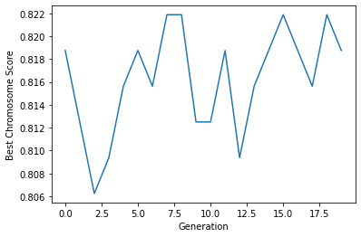

# The Genetic Algorithm

> Biomimicry is the emulation of the models, systems, and elements of nature for the purpose of solving complex human problems. The genetic algorithm, artificial neural networks, and the ant colony algorithm are some examples, to name a few.

[The world is poorly designed. But copying nature helps.](https://www.youtube.com/watch?v=iMtXqTmfta0)

For my first assignment for [Business Analytics](https://github.com/pilsung-kang/Business-Analytics-IME654-), I implemented the genetic algorithm using numpy as the main tensor calculator library, and sklearn for calculating fitness scores. The full Class can be found in `genetic_algorithm/GeneticAlgorithm.py`.

### 0. Data Loading
For this implementation of the genetic algorithm, I used a very famous toy dataset - [The Red Wine Quality Dataset.](https://www.kaggle.com/datasets/uciml/red-wine-quality-cortez-et-al-2009)


```python
# %%
import numpy as np
import pandas as pd
import copy
import random
import pandas as pd
import matplotlib.pyplot as plt
from sklearn.ensemble import RandomForestClassifier
from sklearn.metrics import accuracy_score
from sklearn.model_selection import train_test_split
from sklearn.preprocessing import StandardScaler, LabelEncoder, OneHotEncoder
from tqdm.notebook import tqdm
from GeneticAlgorithm import GeneticAlgorithm

GA = GeneticAlgorithm('winequality-red.csv', pop_size=50, num_generations=20, mutation_rate=0.01, crossover_rate=0.5)
```


```python
class GeneticAlgorithm_Jupyter:
    def __init__(self, df, pop_size=10, num_generations=10, mutation_rate=0.01, crossover_rate=0.5):
        self.df = pd.read_csv(df)
        bins = (2, 5.5, 8)
        group_names = ['bad', 'good']
        target_var = 'quality'
        self.df[target_var] = pd.cut(self.df[target_var], bins = bins, labels = group_names)
        label_quality = LabelEncoder()
        self.df[target_var] = label_quality.fit_transform(self.df[target_var])
        self.data = self.df.drop(target_var, axis=1)
        self.target = self.df[target_var]

GA.df
```


<table border="1" class="dataframe">
  <thead>
    <tr style="text-align: right;">
      <th></th>
      <th>fixed acidity</th>
      <th>volatile acidity</th>
      <th>citric acid</th>
      <th>residual sugar</th>
      <th>chlorides</th>
      <th>free sulfur dioxide</th>
      <th>total sulfur dioxide</th>
      <th>density</th>
      <th>pH</th>
      <th>sulphates</th>
      <th>alcohol</th>
      <th>quality</th>
    </tr>
  </thead>
  <tbody>
    <tr>
      <th>0</th>
      <td>7.4</td>
      <td>0.700</td>
      <td>0.00</td>
      <td>1.9</td>
      <td>0.076</td>
      <td>11.0</td>
      <td>34.0</td>
      <td>0.99780</td>
      <td>3.51</td>
      <td>0.56</td>
      <td>9.4</td>
      <td>0</td>
    </tr>
    <tr>
      <th>1</th>
      <td>7.8</td>
      <td>0.880</td>
      <td>0.00</td>
      <td>2.6</td>
      <td>0.098</td>
      <td>25.0</td>
      <td>67.0</td>
      <td>0.99680</td>
      <td>3.20</td>
      <td>0.68</td>
      <td>9.8</td>
      <td>0</td>
    </tr>
    <tr>
      <th>2</th>
      <td>7.8</td>
      <td>0.760</td>
      <td>0.04</td>
      <td>2.3</td>
      <td>0.092</td>
      <td>15.0</td>
      <td>54.0</td>
      <td>0.99700</td>
      <td>3.26</td>
      <td>0.65</td>
      <td>9.8</td>
      <td>0</td>
    </tr>
    <tr>
      <th>3</th>
      <td>11.2</td>
      <td>0.280</td>
      <td>0.56</td>
      <td>1.9</td>
      <td>0.075</td>
      <td>17.0</td>
      <td>60.0</td>
      <td>0.99800</td>
      <td>3.16</td>
      <td>0.58</td>
      <td>9.8</td>
      <td>1</td>
    </tr>
    <tr>
      <th>4</th>
      <td>7.4</td>
      <td>0.700</td>
      <td>0.00</td>
      <td>1.9</td>
      <td>0.076</td>
      <td>11.0</td>
      <td>34.0</td>
      <td>0.99780</td>
      <td>3.51</td>
      <td>0.56</td>
      <td>9.4</td>
      <td>0</td>
    </tr>
    <tr>
      <th>...</th>
      <td>...</td>
      <td>...</td>
      <td>...</td>
      <td>...</td>
      <td>...</td>
      <td>...</td>
      <td>...</td>
      <td>...</td>
      <td>...</td>
      <td>...</td>
      <td>...</td>
      <td>...</td>
    </tr>
    <tr>
      <th>1594</th>
      <td>6.2</td>
      <td>0.600</td>
      <td>0.08</td>
      <td>2.0</td>
      <td>0.090</td>
      <td>32.0</td>
      <td>44.0</td>
      <td>0.99490</td>
      <td>3.45</td>
      <td>0.58</td>
      <td>10.5</td>
      <td>0</td>
    </tr>
    <tr>
      <th>1595</th>
      <td>5.9</td>
      <td>0.550</td>
      <td>0.10</td>
      <td>2.2</td>
      <td>0.062</td>
      <td>39.0</td>
      <td>51.0</td>
      <td>0.99512</td>
      <td>3.52</td>
      <td>0.76</td>
      <td>11.2</td>
      <td>1</td>
    </tr>
    <tr>
      <th>1596</th>
      <td>6.3</td>
      <td>0.510</td>
      <td>0.13</td>
      <td>2.3</td>
      <td>0.076</td>
      <td>29.0</td>
      <td>40.0</td>
      <td>0.99574</td>
      <td>3.42</td>
      <td>0.75</td>
      <td>11.0</td>
      <td>1</td>
    </tr>
    <tr>
      <th>1597</th>
      <td>5.9</td>
      <td>0.645</td>
      <td>0.12</td>
      <td>2.0</td>
      <td>0.075</td>
      <td>32.0</td>
      <td>44.0</td>
      <td>0.99547</td>
      <td>3.57</td>
      <td>0.71</td>
      <td>10.2</td>
      <td>0</td>
    </tr>
    <tr>
      <th>1598</th>
      <td>6.0</td>
      <td>0.310</td>
      <td>0.47</td>
      <td>3.6</td>
      <td>0.067</td>
      <td>18.0</td>
      <td>42.0</td>
      <td>0.99549</td>
      <td>3.39</td>
      <td>0.66</td>
      <td>11.0</td>
      <td>1</td>
    </tr>
  </tbody>
</table>
<p>1599 rows × 12 columns</p>
</div>


It consists of 11 variables that describe the target variable, being the quality of wine, ranging from scores 3 through 8. To change the given task to binary classification, I used the `pd.cut()` method to split wines with `quality` over 5.5 into `1`, and under into `0`.

### 1. Initialization

The genetic algorithm consists of multiple hyperparameters, including the number of chromosomes (population), the fitness function, crossover mechanism, and the mutation rate.

For this example, I set the hyperparameters as following:


```python
GA = GeneticAlgorithm('winequality-red.csv', pop_size=50, num_generations=20, mutation_rate=0.01, crossover_rate=0.5)
print(GA)
```

    GeneticAlgorithm(pop_size=50, num_generations=20, mutation_rate=0.01, crossover_rate=0.5)


The first step of GA is population initialization.

It refers to how many chromosomes are to be processed in one training iteration. For this example, I used a population size of 50, which in return accounts for 50 boolean arrays with 11 values, corresponding to the number of variables in the dataset.


```python
def initialization(self):
    for i in range(self.pop_size):
        self.population.append(np.random.randint(2, size=len(self.var_names)).astype(bool))
    return self.population

GA.initialization()
```


    [array([False, False,  True,  True, False,  True, False, False, False,
            False,  True]),
     array([ True, False, False, False, False, False, False,  True, False,
             True,  True]),
     array([ True,  True, False, False,  True,  True,  True,  True, False,
            False, False]),
     array([ True,  True,  True, False, False,  True,  True, False,  True,
             True, False]), ...]


```python
np.random.randint(2, size=len(GA.var_names)).astype(bool)
```


    array([ True,  True, False, False, False, False, False,  True, False,
            True, False])


### 2. Fitness Evaluation

Once the population is initialized, fitness evaluation is performed for all chromosomes in the population.

For this example, I used a standard Random Forest classifier and its accuracy score.


```python
def fitness_evaluation(self):
    if self.population:
        pass
    else:
        print('Initializing the first population..')
        self.population = self.initialization()
    
    acc_score = []
    for mask in tqdm(self.population, desc='Calculating Fitness Score..'):
        train_data = self.data[np.array(self.var_names)[mask]]
        x_train, x_test, y_train, y_test = train_test_split(train_data, self.target, test_size=0.2, random_state=0)
        sc = StandardScaler()
        x_train = sc.fit_transform(x_train)
        x_test = sc.fit_transform(x_test)
        rfc = RandomForestClassifier(n_estimators=200)
        rfc.fit(x_train, y_train)
        pred_rfc = rfc.predict(x_test)
        acc = accuracy_score(y_test, pred_rfc)
        acc_score.append(acc)
    fitness_dict = {}
    count = 0
    for score in acc_score:
        fitness_dict[count] = score
        count += 1

    self.fitness_dict = fitness_dict
    self.best_chromosome.append(self.population[max(self.fitness_dict, key=self.fitness_dict.get)])
    self.best_chromosome_score.append(max(self.fitness_dict.values()))
    
    print(f'Best chromosome score: {self.best_chromosome_score[-1]}')
    return self.fitness_dict

GA.fitness_evaluation()
```

    Best chromosome score: 0.809375


    {0: 0.8,
     1: 0.765625,
     2: 0.7625,
     3: 0.765625,
     4: 0.80625,
     5: 0.684375,
     ...,
     49: 0.73125}


Each chromosome in the population is used to mask the variables used to train the RF model.


```python
mask = GA.population[0]
train_data = GA.data[np.array(GA.var_names)[mask]]
train_data
```


<table border="1" class="dataframe">
  <thead>
    <tr style="text-align: right;">
      <th></th>
      <th>citric acid</th>
      <th>residual sugar</th>
      <th>free sulfur dioxide</th>
      <th>alcohol</th>
    </tr>
  </thead>
  <tbody>
    <tr>
      <th>0</th>
      <td>0.00</td>
      <td>1.9</td>
      <td>11.0</td>
      <td>9.4</td>
    </tr>
    <tr>
      <th>1</th>
      <td>0.00</td>
      <td>2.6</td>
      <td>25.0</td>
      <td>9.8</td>
    </tr>
    <tr>
      <th>2</th>
      <td>0.04</td>
      <td>2.3</td>
      <td>15.0</td>
      <td>9.8</td>
    </tr>
    <tr>
      <th>3</th>
      <td>0.56</td>
      <td>1.9</td>
      <td>17.0</td>
      <td>9.8</td>
    </tr>
    <tr>
      <th>4</th>
      <td>0.00</td>
      <td>1.9</td>
      <td>11.0</td>
      <td>9.4</td>
    </tr>
    <tr>
      <th>...</th>
      <td>...</td>
      <td>...</td>
      <td>...</td>
      <td>...</td>
    </tr>
    <tr>
      <th>1594</th>
      <td>0.08</td>
      <td>2.0</td>
      <td>32.0</td>
      <td>10.5</td>
    </tr>
    <tr>
      <th>1595</th>
      <td>0.10</td>
      <td>2.2</td>
      <td>39.0</td>
      <td>11.2</td>
    </tr>
    <tr>
      <th>1596</th>
      <td>0.13</td>
      <td>2.3</td>
      <td>29.0</td>
      <td>11.0</td>
    </tr>
    <tr>
      <th>1597</th>
      <td>0.12</td>
      <td>2.0</td>
      <td>32.0</td>
      <td>10.2</td>
    </tr>
    <tr>
      <th>1598</th>
      <td>0.47</td>
      <td>3.6</td>
      <td>18.0</td>
      <td>11.0</td>
    </tr>
  </tbody>
</table>
<p>1599 rows × 4 columns</p>
</div>


For the first chromosome, the RF model trains using only 6 variables.

For each generation, the accuracy from the RF model is calculated and stored in `self.fitness_dict`, and the chromosome with the highest accuracy is stored in `self.best_chromosome_score`.


```python
GA.fitness_dict
```


    {0: 0.8,
     1: 0.765625,
     2: 0.7625,
     3: 0.765625,
     4: 0.80625,
     5: 0.684375,
     ...
     49: 0.73125}


### 3. Selection

Once fitness evaluation has been conducted for all chromosomes in the population, a selection criterion determines which chromosome in the population is fit enough to pass on its genes (e.g. its variables) to the next generation. 


```python
def probabilistic_selection(self):
    if self.fitness_dict:
        pass
    else:
        self.fitness_dict = self.fitness_evaluation()
    fitness_score = list(self.fitness_dict.values())
    fitness_score = self.softmax(fitness_score)
    selection = np.random.choice(list(self.fitness_dict.keys()), self.pop_size, p=list(fitness_score), replace=True)
    parent_population = []
    elite = max(self.fitness_dict)
    parent_population.append(self.population[elite])
    for choice in selection[:-1]:
        parent_population.append(self.population[choice])
    
    self.parent_population = parent_population
    return self.parent_population

GA.probabilistic_selection()
```


    [array([False,  True, False, False, False,  True, False,  True,  True,
             True, False]),
     array([ True, False, False, False,  True, False, False,  True, False,
            False,  True]),
     array([False, False,  True,  True, False,  True, False, False, False,
            False, False]),
     array([False,  True, False, False,  True,  True, False, False,  True,
             True, False]),
     array([ True, False, False, False,  True, False, False,  True, False,
            False,  True]),
             ...]


First, the values of the fitness scores are called into a list.


```python
fitness_score = list(GA.fitness_dict.values())
fitness_score
```


    [0.8,
     0.765625,
     0.7625,
     0.765625,
     0.80625,
     0.684375,
     ...,
     0.73125]


Chromosome selection can be performed in 2 ways:

1. Deterministic selection
- Select only the top N% of chromosomes

2. Probabilistic selection
- Fitness score is used as a weight for each chromosome

I chose to implement probabilistic selection for this example, since it gives the chromosomes with low scores a slight chance to be selected, henece acquiring diversity.

I passed each score into the softmax function, which normalizes all fitness scores into a probability.


```python
fitness_score = GA.softmax(fitness_score)
fitness_score
```


    array([0.02120602, 0.02048945, 0.02042552, 0.02048945, 0.02133897,
           0.01889052, 0.02074717, 0.01998356, 0.01936873, 0.02042552,
           0.01985905, 0.01830932, 0.01992121, 0.02094259, 0.02100814,
           0.02017179, 0.01967374, 0.02029826, 0.01998356, 0.01979709,
           0.02133897, 0.01973532, 0.02113985, 0.02010885, 0.02120602,
           0.02107389, 0.02029826, 0.01877282, 0.02042552, 0.02107389,
           0.017746  , 0.01900895, 0.01985905, 0.019188  , 0.0193083 ,
           0.019188  , 0.02120602, 0.01889052, 0.02048945, 0.02120602,
           0.01949016, 0.02074717, 0.02061791, 0.01813847, 0.02055358,
           0.02140576, 0.01900895, 0.01871424, 0.01693335, 0.01979709])


I used the `np.random.choice()` method to sample each chromosome **With Replacement**, using the softmax values of the fitness score as the probability for each chromosome to be sampled.


```python
selection = np.random.choice(list(GA.fitness_dict.keys()), GA.pop_size, p=list(fitness_score), replace=True)
selection
```


    array([43, 10, 45, 27, 15, 13, 28, 12, 17, 39, 25, 49,  6, 10, 28, 26, 17,
            2,  2, 15,  6, 23, 20,  9,  1, 36, 18, 31, 23, 23, 46,  3, 27, 43,
           35,  1,  2, 36,  1, 49, 38, 25, 27,  3,  7,  9, 13, 34,  5, 23])


A good practice in the genetic algorithm is to implement **Elitism**.

For each generation, there is no guarantee that the children chromosomes are better than their respective parent chromosomes. So for safety, N chromosomes with the best fitness scores are deterministicly selected in the selection process.

For my example, I chose `elitism = 1`, which means that the chromosome with the best fitness score in its population is guaranteed to be passed on.


```python
parent_population = []
elite = max(GA.fitness_dict)
print(elite)

parent_population.append(GA.population[elite])
for choice in selection[:-1]:
    parent_population.append(GA.population[choice])
```

    49


### 4. Crossover

Once the parent chromosomes have been chosen either through deterministic or probabilistic selection, 2 parent chromosomes exchange their genes in order to produce 2 child chromosomes.

The crossover point, a hyperparameter, determines the number of "slices" that are made in the parent chromosome. However, it is considered good practice to use `crossover_rate` instead of `crossover_point`.

Crossover rate determines the probability of gene crossover given to the parent chromosomes' genes. For my example, I used `crossover_rate=0.5` meaning that each gene has a 50% chance of crossing over.


```python
def crossover(self):
    if self.parent_population:
        pass
    else:
        self.parent_population = self.probabilistic_selection()

    crossover_population = []
    for i in range(0, len(self.parent_population), 2):
        if np.random.rand() < self.crossover_rate:
            crossover_point = np.random.randint(1, len(self.var_names) - 1)
            parent1 = self.parent_population[i]
            parent2 = self.parent_population[i + 1]
            child1 = np.concatenate((parent1[:crossover_point], parent2[crossover_point:]))
            child2 = np.concatenate((parent2[:crossover_point], parent1[crossover_point:]))
            crossover_population.append(child1)
            crossover_population.append(child2)
        else:
            crossover_population.append(self.parent_population[i])
            crossover_population.append(self.parent_population[i + 1])
    
    self.crossover_population = crossover_population
    self.before_mutation = copy.deepcopy(self.crossover_population)
    return self.crossover_population

GA.crossover()
```


    [array([False,  True, False, False,  True, False, False,  True, False,
            False,  True]),
     array([ True, False, False, False, False,  True, False,  True,  True,
             True, False]),
     array([False, False,  True,  True, False,  True, False, False, False,
            False, False]),
     array([False,  True, False, False,  True,  True, False, False,  True,
             True, False]), ...]


I used the `np.random.rand()` method to determine wheter each pair of parent chromosomes were to be crossed over. If the random number initialized was under `crossover_rate=0.5`, a random crossover point is initialized.


```python
crossover_point = np.random.randint(1, len(GA.var_names) - 1)
crossover_point
```


    3


### 5. Mutation

Mutation is another genetic operator that is taken from biomimicry.

After children chromosomes are made through the crossover process, a very small probability is given to each chromosome where its binary gene is flipped.

Mutation allows an entirely new gene value to be added to the population, hence acting as a tool to escape the local optima. However, a large mutation rate can drastically increase the time for the algorithm to converge.

For my example, I chose `mutation_rate=0.01`.


```python
def mutation(self):
    if self.crossover_population:
        pass
    else:
        self.crossover_population = self.crossover()

    mutation_population = []
    for i in range(len(self.crossover_population)):
        if np.random.rand() < self.mutation_rate:
            mutation_point = np.random.randint(0, len(self.var_names))
            mutated_child = self.crossover_population[i]
            mutated_child[mutation_point] = not mutated_child[mutation_point]
            mutation_population.append(mutated_child)
        else:
            mutation_population.append(self.crossover_population[i])
    
    self.population = mutation_population
    return self.population

GA.mutation()
```


    [array([False,  True, False, False,  True, False, False,  True, False,
            False,  True]),
     array([ True, False, False, False, False,  True, False,  True,  True,
             True, False]),
     array([False, False,  True,  True, False,  True, False, False, False,
            False, False]),
     array([False,  True, False, False,  True,  True, False, False,  True,
             True, False]),
     array([ True, False, False, False,  True, False, False,  True, False,
            False,  True]),
     array([False, False, False,  True, False, False,  True,  True,  True,
             True,  True]),
     array([ True, False, False, False, False, False, False,  True, False,
             True,  True]), ...]


Since the mutation rate is so small, mutation rarely happens. But in order to show that the mutation function truly works, the next example is an instance of the `mutation_rate` set to `0.9`.


```python
mut_example = GeneticAlgorithm('winequality-red.csv', pop_size=10, num_generations=10, mutation_rate=0.9, crossover_rate=0.5)
mut_example.fitness_evaluation()
mut_example.probabilistic_selection()
mut_example.crossover()
mut_example.mutation()

before_mutation = mut_example.before_mutation
after_mutation = mut_example.population

for i, j in zip(before_mutation, after_mutation):
    print((i == j).all())
```

    Initializing the first population..
    Best chromosome score: 0.8
    False
    False
    False
    True
    False
    False
    False
    False
    False
    False


For 10 chromosomes in the children population, 9 have mutated (hence the boolean operator `i==j.all()` being `False`) and 1 hasn't.

### Running the Algorithm

The full algorithm can be run using the `run_algorithm()` method in the `GeneticAlgorithm` class, and its result can be shown using the `plot()` method.


```python
def run_algorithm(self):
    for i in tqdm(range(self.num_generations)):
        print(f'Generation {i+1}')
        self.fitness_dict = self.fitness_evaluation()
        self.parent_population = self.probabilistic_selection()
        self.crossover_population = self.crossover()
        self.mutation_population = self.mutation()
    
def plot(self):
    plt.plot(self.best_chromosome_score)
    plt.xlabel('Generation')
    plt.ylabel('Best Chromosome Score')
    plt.show();
    
GA = GeneticAlgorithm('winequality-red.csv', pop_size=50, num_generations=20, mutation_rate=0.01, crossover_rate=0.5)
GA.run_algorithm()
```


      0%|          | 0/20 [00:00<?, ?it/s]


    Generation 1
    Initializing the first population..
    Best chromosome score: 0.81875
    Generation 2
    Best chromosome score: 0.8125
    Generation 3
    Best chromosome score: 0.80625
    Generation 4
    Best chromosome score: 0.809375
    Generation 5
    Best chromosome score: 0.815625
    Generation 6
    Best chromosome score: 0.81875
    Generation 7
    Best chromosome score: 0.815625
    Generation 8
    Best chromosome score: 0.821875
    Generation 9
    Best chromosome score: 0.821875
    Generation 10
    Best chromosome score: 0.8125
    Generation 11
    Best chromosome score: 0.8125
    Generation 12
    Best chromosome score: 0.81875
    Generation 13
    Best chromosome score: 0.809375
    Generation 14
    Best chromosome score: 0.815625
    Generation 15
    Best chromosome score: 0.81875
    Generation 16
    Best chromosome score: 0.821875
    Generation 17
    Best chromosome score: 0.81875
    Generation 18
    Best chromosome score: 0.815625
    Generation 19
    Best chromosome score: 0.821875
    Generation 20
    Best chromosome score: 0.81875


```python
GA.plot()
```


    

    


It can be seen that as the generation increases, the accuracy of the best chromosome of each generation has a rising trend. However, It seems that the accuracy score has a clear ceiling of about 0.822. This can be due to a number of reasons:

1. The dataset.
The dataset itself is a very small dataset. It has only 1599 samples and 11 variables that describe the target variable. Since the genetic algorithm decides on which variable to use for its fitness evaluation, 11 variables don't have a lot of diversity.

2. Correlation between variables.
From the correlation matrix below, it can be seen that not much variables have a high correlation. If many variables had higher correlations, the genetic algorithm may have found better combinations of variables that increase the accuracy overall.

```python
corr = GA.data.corr()
corr.style.background_gradient(cmap='coolwarm')
```

</style>
<table id="T_66d25">
  <thead>
    <tr>
      <th class="blank level0" >&nbsp;</th>
      <th id="T_66d25_level0_col0" class="col_heading level0 col0" >fixed acidity</th>
      <th id="T_66d25_level0_col1" class="col_heading level0 col1" >volatile acidity</th>
      <th id="T_66d25_level0_col2" class="col_heading level0 col2" >citric acid</th>
      <th id="T_66d25_level0_col3" class="col_heading level0 col3" >residual sugar</th>
      <th id="T_66d25_level0_col4" class="col_heading level0 col4" >chlorides</th>
      <th id="T_66d25_level0_col5" class="col_heading level0 col5" >free sulfur dioxide</th>
      <th id="T_66d25_level0_col6" class="col_heading level0 col6" >total sulfur dioxide</th>
      <th id="T_66d25_level0_col7" class="col_heading level0 col7" >density</th>
      <th id="T_66d25_level0_col8" class="col_heading level0 col8" >pH</th>
      <th id="T_66d25_level0_col9" class="col_heading level0 col9" >sulphates</th>
      <th id="T_66d25_level0_col10" class="col_heading level0 col10" >alcohol</th>
    </tr>
  </thead>
  <tbody>
    <tr>
      <th id="T_66d25_level0_row0" class="row_heading level0 row0" >fixed acidity</th>
      <td id="T_66d25_row0_col0" class="data row0 col0" >1.000000</td>
      <td id="T_66d25_row0_col1" class="data row0 col1" >-0.256131</td>
      <td id="T_66d25_row0_col2" class="data row0 col2" >0.671703</td>
      <td id="T_66d25_row0_col3" class="data row0 col3" >0.114777</td>
      <td id="T_66d25_row0_col4" class="data row0 col4" >0.093705</td>
      <td id="T_66d25_row0_col5" class="data row0 col5" >-0.153794</td>
      <td id="T_66d25_row0_col6" class="data row0 col6" >-0.113181</td>
      <td id="T_66d25_row0_col7" class="data row0 col7" >0.668047</td>
      <td id="T_66d25_row0_col8" class="data row0 col8" >-0.682978</td>
      <td id="T_66d25_row0_col9" class="data row0 col9" >0.183006</td>
      <td id="T_66d25_row0_col10" class="data row0 col10" >-0.061668</td>
    </tr>
    <tr>
      <th id="T_66d25_level0_row1" class="row_heading level0 row1" >volatile acidity</th>
      <td id="T_66d25_row1_col0" class="data row1 col0" >-0.256131</td>
      <td id="T_66d25_row1_col1" class="data row1 col1" >1.000000</td>
      <td id="T_66d25_row1_col2" class="data row1 col2" >-0.552496</td>
      <td id="T_66d25_row1_col3" class="data row1 col3" >0.001918</td>
      <td id="T_66d25_row1_col4" class="data row1 col4" >0.061298</td>
      <td id="T_66d25_row1_col5" class="data row1 col5" >-0.010504</td>
      <td id="T_66d25_row1_col6" class="data row1 col6" >0.076470</td>
      <td id="T_66d25_row1_col7" class="data row1 col7" >0.022026</td>
      <td id="T_66d25_row1_col8" class="data row1 col8" >0.234937</td>
      <td id="T_66d25_row1_col9" class="data row1 col9" >-0.260987</td>
      <td id="T_66d25_row1_col10" class="data row1 col10" >-0.202288</td>
    </tr>
    <tr>
      <th id="T_66d25_level0_row2" class="row_heading level0 row2" >citric acid</th>
      <td id="T_66d25_row2_col0" class="data row2 col0" >0.671703</td>
      <td id="T_66d25_row2_col1" class="data row2 col1" >-0.552496</td>
      <td id="T_66d25_row2_col2" class="data row2 col2" >1.000000</td>
      <td id="T_66d25_row2_col3" class="data row2 col3" >0.143577</td>
      <td id="T_66d25_row2_col4" class="data row2 col4" >0.203823</td>
      <td id="T_66d25_row2_col5" class="data row2 col5" >-0.060978</td>
      <td id="T_66d25_row2_col6" class="data row2 col6" >0.035533</td>
      <td id="T_66d25_row2_col7" class="data row2 col7" >0.364947</td>
      <td id="T_66d25_row2_col8" class="data row2 col8" >-0.541904</td>
      <td id="T_66d25_row2_col9" class="data row2 col9" >0.312770</td>
      <td id="T_66d25_row2_col10" class="data row2 col10" >0.109903</td>
    </tr>
    <tr>
      <th id="T_66d25_level0_row3" class="row_heading level0 row3" >residual sugar</th>
      <td id="T_66d25_row3_col0" class="data row3 col0" >0.114777</td>
      <td id="T_66d25_row3_col1" class="data row3 col1" >0.001918</td>
      <td id="T_66d25_row3_col2" class="data row3 col2" >0.143577</td>
      <td id="T_66d25_row3_col3" class="data row3 col3" >1.000000</td>
      <td id="T_66d25_row3_col4" class="data row3 col4" >0.055610</td>
      <td id="T_66d25_row3_col5" class="data row3 col5" >0.187049</td>
      <td id="T_66d25_row3_col6" class="data row3 col6" >0.203028</td>
      <td id="T_66d25_row3_col7" class="data row3 col7" >0.355283</td>
      <td id="T_66d25_row3_col8" class="data row3 col8" >-0.085652</td>
      <td id="T_66d25_row3_col9" class="data row3 col9" >0.005527</td>
      <td id="T_66d25_row3_col10" class="data row3 col10" >0.042075</td>
    </tr>
    <tr>
      <th id="T_66d25_level0_row4" class="row_heading level0 row4" >chlorides</th>
      <td id="T_66d25_row4_col0" class="data row4 col0" >0.093705</td>
      <td id="T_66d25_row4_col1" class="data row4 col1" >0.061298</td>
      <td id="T_66d25_row4_col2" class="data row4 col2" >0.203823</td>
      <td id="T_66d25_row4_col3" class="data row4 col3" >0.055610</td>
      <td id="T_66d25_row4_col4" class="data row4 col4" >1.000000</td>
      <td id="T_66d25_row4_col5" class="data row4 col5" >0.005562</td>
      <td id="T_66d25_row4_col6" class="data row4 col6" >0.047400</td>
      <td id="T_66d25_row4_col7" class="data row4 col7" >0.200632</td>
      <td id="T_66d25_row4_col8" class="data row4 col8" >-0.265026</td>
      <td id="T_66d25_row4_col9" class="data row4 col9" >0.371260</td>
      <td id="T_66d25_row4_col10" class="data row4 col10" >-0.221141</td>
    </tr>
    <tr>
      <th id="T_66d25_level0_row5" class="row_heading level0 row5" >free sulfur dioxide</th>
      <td id="T_66d25_row5_col0" class="data row5 col0" >-0.153794</td>
      <td id="T_66d25_row5_col1" class="data row5 col1" >-0.010504</td>
      <td id="T_66d25_row5_col2" class="data row5 col2" >-0.060978</td>
      <td id="T_66d25_row5_col3" class="data row5 col3" >0.187049</td>
      <td id="T_66d25_row5_col4" class="data row5 col4" >0.005562</td>
      <td id="T_66d25_row5_col5" class="data row5 col5" >1.000000</td>
      <td id="T_66d25_row5_col6" class="data row5 col6" >0.667666</td>
      <td id="T_66d25_row5_col7" class="data row5 col7" >-0.021946</td>
      <td id="T_66d25_row5_col8" class="data row5 col8" >0.070377</td>
      <td id="T_66d25_row5_col9" class="data row5 col9" >0.051658</td>
      <td id="T_66d25_row5_col10" class="data row5 col10" >-0.069408</td>
    </tr>
    <tr>
      <th id="T_66d25_level0_row6" class="row_heading level0 row6" >total sulfur dioxide</th>
      <td id="T_66d25_row6_col0" class="data row6 col0" >-0.113181</td>
      <td id="T_66d25_row6_col1" class="data row6 col1" >0.076470</td>
      <td id="T_66d25_row6_col2" class="data row6 col2" >0.035533</td>
      <td id="T_66d25_row6_col3" class="data row6 col3" >0.203028</td>
      <td id="T_66d25_row6_col4" class="data row6 col4" >0.047400</td>
      <td id="T_66d25_row6_col5" class="data row6 col5" >0.667666</td>
      <td id="T_66d25_row6_col6" class="data row6 col6" >1.000000</td>
      <td id="T_66d25_row6_col7" class="data row6 col7" >0.071269</td>
      <td id="T_66d25_row6_col8" class="data row6 col8" >-0.066495</td>
      <td id="T_66d25_row6_col9" class="data row6 col9" >0.042947</td>
      <td id="T_66d25_row6_col10" class="data row6 col10" >-0.205654</td>
    </tr>
    <tr>
      <th id="T_66d25_level0_row7" class="row_heading level0 row7" >density</th>
      <td id="T_66d25_row7_col0" class="data row7 col0" >0.668047</td>
      <td id="T_66d25_row7_col1" class="data row7 col1" >0.022026</td>
      <td id="T_66d25_row7_col2" class="data row7 col2" >0.364947</td>
      <td id="T_66d25_row7_col3" class="data row7 col3" >0.355283</td>
      <td id="T_66d25_row7_col4" class="data row7 col4" >0.200632</td>
      <td id="T_66d25_row7_col5" class="data row7 col5" >-0.021946</td>
      <td id="T_66d25_row7_col6" class="data row7 col6" >0.071269</td>
      <td id="T_66d25_row7_col7" class="data row7 col7" >1.000000</td>
      <td id="T_66d25_row7_col8" class="data row7 col8" >-0.341699</td>
      <td id="T_66d25_row7_col9" class="data row7 col9" >0.148506</td>
      <td id="T_66d25_row7_col10" class="data row7 col10" >-0.496180</td>
    </tr>
    <tr>
      <th id="T_66d25_level0_row8" class="row_heading level0 row8" >pH</th>
      <td id="T_66d25_row8_col0" class="data row8 col0" >-0.682978</td>
      <td id="T_66d25_row8_col1" class="data row8 col1" >0.234937</td>
      <td id="T_66d25_row8_col2" class="data row8 col2" >-0.541904</td>
      <td id="T_66d25_row8_col3" class="data row8 col3" >-0.085652</td>
      <td id="T_66d25_row8_col4" class="data row8 col4" >-0.265026</td>
      <td id="T_66d25_row8_col5" class="data row8 col5" >0.070377</td>
      <td id="T_66d25_row8_col6" class="data row8 col6" >-0.066495</td>
      <td id="T_66d25_row8_col7" class="data row8 col7" >-0.341699</td>
      <td id="T_66d25_row8_col8" class="data row8 col8" >1.000000</td>
      <td id="T_66d25_row8_col9" class="data row8 col9" >-0.196648</td>
      <td id="T_66d25_row8_col10" class="data row8 col10" >0.205633</td>
    </tr>
    <tr>
      <th id="T_66d25_level0_row9" class="row_heading level0 row9" >sulphates</th>
      <td id="T_66d25_row9_col0" class="data row9 col0" >0.183006</td>
      <td id="T_66d25_row9_col1" class="data row9 col1" >-0.260987</td>
      <td id="T_66d25_row9_col2" class="data row9 col2" >0.312770</td>
      <td id="T_66d25_row9_col3" class="data row9 col3" >0.005527</td>
      <td id="T_66d25_row9_col4" class="data row9 col4" >0.371260</td>
      <td id="T_66d25_row9_col5" class="data row9 col5" >0.051658</td>
      <td id="T_66d25_row9_col6" class="data row9 col6" >0.042947</td>
      <td id="T_66d25_row9_col7" class="data row9 col7" >0.148506</td>
      <td id="T_66d25_row9_col8" class="data row9 col8" >-0.196648</td>
      <td id="T_66d25_row9_col9" class="data row9 col9" >1.000000</td>
      <td id="T_66d25_row9_col10" class="data row9 col10" >0.093595</td>
    </tr>
    <tr>
      <th id="T_66d25_level0_row10" class="row_heading level0 row10" >alcohol</th>
      <td id="T_66d25_row10_col0" class="data row10 col0" >-0.061668</td>
      <td id="T_66d25_row10_col1" class="data row10 col1" >-0.202288</td>
      <td id="T_66d25_row10_col2" class="data row10 col2" >0.109903</td>
      <td id="T_66d25_row10_col3" class="data row10 col3" >0.042075</td>
      <td id="T_66d25_row10_col4" class="data row10 col4" >-0.221141</td>
      <td id="T_66d25_row10_col5" class="data row10 col5" >-0.069408</td>
      <td id="T_66d25_row10_col6" class="data row10 col6" >-0.205654</td>
      <td id="T_66d25_row10_col7" class="data row10 col7" >-0.496180</td>
      <td id="T_66d25_row10_col8" class="data row10 col8" >0.205633</td>
      <td id="T_66d25_row10_col9" class="data row10 col9" >0.093595</td>
      <td id="T_66d25_row10_col10" class="data row10 col10" >1.000000</td>
    </tr>
  </tbody>
</table>


```python

```
