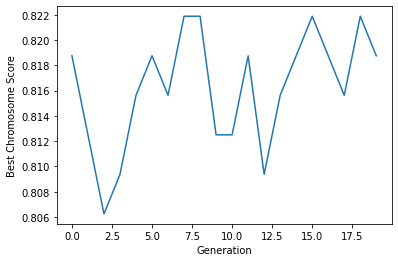

# The Genetic Algorithm

> Biomimicry 란 자연에서 볼 수 있는 디자인적 요소들이나 생물체의 특성들을 연구 및 모방하는 분야다. 딥러닝의 초기 모델인 인공신경망은 사람의 뇌의 Biomimicry 모델이며, 최적화 이론에선 유전 알고리즘, Ant Colony Algorithm, Particle Swarm Optimization 등이 대표적인 Biomimicry 방법론들이다.

[The world is poorly designed. But copying nature helps.](https://www.youtube.com/watch?v=iMtXqTmfta0)

유전 알고리즘은 환경에 특화되고 가장 우월한 개체만 다음 세대로 유전자를 남긴다는 다윈의 자연선택설에 기초한다. 열등한 유전자는 자연스럽게 도태되는 아이디어를 그대로 가져와 Selection, Crossover, Mutation 과정을 거쳐 가장 우월한 ‘유전자’, 즉 설명변수를 최종적으로 구하는 알고리즘이다.

유전 알고리즘을 구현하기 위해 tensor 계산은 numpy, fitness score 계산은 scikit learn 을 사용했다. 전체 클래스는 `genetic_algorithm/GeneticAlgorithm.py` 에서 import 할 수 있다.

### 0. Data Loading
사용한 데이터셋은 굉장히 유명한 toy dataset - [The Red Wine Quality Dataset](https://www.kaggle.com/datasets/uciml/red-wine-quality-cortez-et-al-2009) 이다.


```python
# %%
import numpy as np
import pandas as pd
import copy
import random
import pandas as pd
import matplotlib.pyplot as plt
from sklearn.ensemble import RandomForestClassifier
from sklearn.metrics import accuracy_score
from sklearn.model_selection import train_test_split
from sklearn.preprocessing import StandardScaler, LabelEncoder, OneHotEncoder
from tqdm.notebook import tqdm
from GeneticAlgorithm import GeneticAlgorithm

GA = GeneticAlgorithm('winequality-red.csv', pop_size=50, num_generations=20, mutation_rate=0.01, crossover_rate=0.5)
```


```python
class GeneticAlgorithm_Jupyter:
    def __init__(self, df, pop_size=10, num_generations=10, mutation_rate=0.01, crossover_rate=0.5):
        self.df = pd.read_csv(df)
        bins = (2, 5.5, 8)
        group_names = ['bad', 'good']
        target_var = 'quality'
        self.df[target_var] = pd.cut(self.df[target_var], bins = bins, labels = group_names)
        label_quality = LabelEncoder()
        self.df[target_var] = label_quality.fit_transform(self.df[target_var])
        self.data = self.df.drop(target_var, axis=1)
        self.target = self.df[target_var]

GA.df
```


<div>
<style scoped>
    .dataframe tbody tr th:only-of-type {
        vertical-align: middle;
    }

    .dataframe tbody tr th {
        vertical-align: top;
    }

    .dataframe thead th {
        text-align: right;
    }
</style>
<table border="1" class="dataframe">
  <thead>
    <tr style="text-align: right;">
      <th></th>
      <th>fixed acidity</th>
      <th>volatile acidity</th>
      <th>citric acid</th>
      <th>residual sugar</th>
      <th>chlorides</th>
      <th>free sulfur dioxide</th>
      <th>total sulfur dioxide</th>
      <th>density</th>
      <th>pH</th>
      <th>sulphates</th>
      <th>alcohol</th>
      <th>quality</th>
    </tr>
  </thead>
  <tbody>
    <tr>
      <th>0</th>
      <td>7.4</td>
      <td>0.700</td>
      <td>0.00</td>
      <td>1.9</td>
      <td>0.076</td>
      <td>11.0</td>
      <td>34.0</td>
      <td>0.99780</td>
      <td>3.51</td>
      <td>0.56</td>
      <td>9.4</td>
      <td>0</td>
    </tr>
    <tr>
      <th>1</th>
      <td>7.8</td>
      <td>0.880</td>
      <td>0.00</td>
      <td>2.6</td>
      <td>0.098</td>
      <td>25.0</td>
      <td>67.0</td>
      <td>0.99680</td>
      <td>3.20</td>
      <td>0.68</td>
      <td>9.8</td>
      <td>0</td>
    </tr>
    <tr>
      <th>2</th>
      <td>7.8</td>
      <td>0.760</td>
      <td>0.04</td>
      <td>2.3</td>
      <td>0.092</td>
      <td>15.0</td>
      <td>54.0</td>
      <td>0.99700</td>
      <td>3.26</td>
      <td>0.65</td>
      <td>9.8</td>
      <td>0</td>
    </tr>
    <tr>
      <th>3</th>
      <td>11.2</td>
      <td>0.280</td>
      <td>0.56</td>
      <td>1.9</td>
      <td>0.075</td>
      <td>17.0</td>
      <td>60.0</td>
      <td>0.99800</td>
      <td>3.16</td>
      <td>0.58</td>
      <td>9.8</td>
      <td>1</td>
    </tr>
    <tr>
      <th>4</th>
      <td>7.4</td>
      <td>0.700</td>
      <td>0.00</td>
      <td>1.9</td>
      <td>0.076</td>
      <td>11.0</td>
      <td>34.0</td>
      <td>0.99780</td>
      <td>3.51</td>
      <td>0.56</td>
      <td>9.4</td>
      <td>0</td>
    </tr>
    <tr>
      <th>...</th>
      <td>...</td>
      <td>...</td>
      <td>...</td>
      <td>...</td>
      <td>...</td>
      <td>...</td>
      <td>...</td>
      <td>...</td>
      <td>...</td>
      <td>...</td>
      <td>...</td>
      <td>...</td>
    </tr>
    <tr>
      <th>1594</th>
      <td>6.2</td>
      <td>0.600</td>
      <td>0.08</td>
      <td>2.0</td>
      <td>0.090</td>
      <td>32.0</td>
      <td>44.0</td>
      <td>0.99490</td>
      <td>3.45</td>
      <td>0.58</td>
      <td>10.5</td>
      <td>0</td>
    </tr>
    <tr>
      <th>1595</th>
      <td>5.9</td>
      <td>0.550</td>
      <td>0.10</td>
      <td>2.2</td>
      <td>0.062</td>
      <td>39.0</td>
      <td>51.0</td>
      <td>0.99512</td>
      <td>3.52</td>
      <td>0.76</td>
      <td>11.2</td>
      <td>1</td>
    </tr>
    <tr>
      <th>1596</th>
      <td>6.3</td>
      <td>0.510</td>
      <td>0.13</td>
      <td>2.3</td>
      <td>0.076</td>
      <td>29.0</td>
      <td>40.0</td>
      <td>0.99574</td>
      <td>3.42</td>
      <td>0.75</td>
      <td>11.0</td>
      <td>1</td>
    </tr>
    <tr>
      <th>1597</th>
      <td>5.9</td>
      <td>0.645</td>
      <td>0.12</td>
      <td>2.0</td>
      <td>0.075</td>
      <td>32.0</td>
      <td>44.0</td>
      <td>0.99547</td>
      <td>3.57</td>
      <td>0.71</td>
      <td>10.2</td>
      <td>0</td>
    </tr>
    <tr>
      <th>1598</th>
      <td>6.0</td>
      <td>0.310</td>
      <td>0.47</td>
      <td>3.6</td>
      <td>0.067</td>
      <td>18.0</td>
      <td>42.0</td>
      <td>0.99549</td>
      <td>3.39</td>
      <td>0.66</td>
      <td>11.0</td>
      <td>1</td>
    </tr>
  </tbody>
</table>
<p>1599 rows × 12 columns</p>
</div>


해당 데이터셋은 와인의 퀄리티를 설명해주는 11개의 설명변수로 이루어져 있다. 와인의 퀄리티는 3~8의 점수로 기록되어 있으며, 해당 task 를 binary classification 으로 바꿔주기 위해 `pd.cut()` 을 통해 퀄리티가 5.5 이상은 `1`, 이하는 `0` 로 대체하였다.

### 1. Initialization

유전 알고리즘의 첫 단계는 초기값 설정, 혹은 Encoding 이다. 유전 알고리즘은 머신러닝 이외에도 다양한 분야에서 사용되기 때문에 Encoding 방법론은 분야마다 상이하지만, 차원축소에서 사용되는 유전 알고리즘에선 Binary Encoding 이 사용된다.

하나의 chromosome 은 데이터셋이 가지고 있는 변수의 수 만큼 Gene 을 가지고 있으며, 처음 알고리즘을 시작할 때 랜덤하게 각 Gene 에 0 혹은 1 의 Binary 값이 주어진다. 알고리즘의 최종 output 은 하나의 chromosome 이며, 1로 활성화 되어있는 Gene 을 사용한다.


```python
GA = GeneticAlgorithm('winequality-red.csv', pop_size=50, num_generations=20, mutation_rate=0.01, crossover_rate=0.5)
print(GA)
```

    GeneticAlgorithm(pop_size=50, num_generations=20, mutation_rate=0.01, crossover_rate=0.5)


- Population Initialization: Hyperparameter 로, 알고리즘에 사용할 chromosome 의 개수를 설정한다. 보통 50~100개의 chromosome 을 사용한다.

- Fitness Function: 각 chromosome 의 성능, 혹은 ‘우월성’ 을 판별하기 위한 평가지표다. 학습하고자 하는 모델의 loss function 을 사용한다.

- Crossover Mechanism: Hyperparameter 로, 몇개의 crossover point 로 알고리즘을 진행할지 정한다.

- Mutation Rate: Hyperparameter 로, chromosome 의 gene 이 반대값으로 활성화/비활성화 될 확률이다. 보통 0.01 (1%) 를 사용한다.

- Stopping Criteria: 알고리즘의 종료조건이다. 한 세대에서 다음 세대로 넘어갈때 fitness function 의 증가값이 특정 범주를 넘지 못하거나, 설정한 세대까지 진화를 했다면 멈추도록 설정 할 수 있다.


```python
def initialization(self):
    for i in range(self.pop_size):
        self.population.append(np.random.randint(2, size=len(self.var_names)).astype(bool))
    return self.population

GA.initialization()
```


    [array([False, False,  True,  True, False,  True, False, False, False,
            False,  True]),
     array([ True, False, False, False, False, False, False,  True, False,
             True,  True]),
     array([ True,  True, False, False,  True,  True,  True,  True, False,
            False, False]),
     array([ True,  True,  True, False, False,  True,  True, False,  True,
             True, False]),
     array([False, False, False,  True, False, False,  True,  True,  True,
             True,  True]),
     array([False, False,  True,  True, False,  True,  True, False, False,
            False, False]),
     array([False, False,  True, False, False, False,  True, False, False,
             True,  True]),
     array([ True, False, False, False, False, False,  True,  True, False,
             True, False]),
     array([False, False, False, False,  True, False, False,  True, False,
             True, False]),
     array([ True, False, False, False, False,  True, False, False,  True,
             True,  True]),
     array([False,  True,  True, False,  True,  True,  True, False, False,
             True, False]),
     array([False, False,  True,  True, False,  True, False, False, False,
            False, False]),
     array([False, False,  True, False, False, False, False, False,  True,
            False,  True]),
     array([False, False, False, False, False,  True, False,  True,  True,
             True,  True]),
     array([False,  True,  True,  True,  True,  True,  True, False, False,
             True,  True]),
     array([False, False,  True, False, False, False,  True,  True, False,
            False,  True]),
     array([ True, False,  True,  True,  True, False, False, False, False,
             True, False]),
     array([False, False,  True, False,  True, False, False,  True, False,
            False,  True]),
     array([False,  True, False,  True,  True, False, False,  True,  True,
            False, False]),
     array([False, False,  True,  True,  True, False, False, False, False,
             True, False]),
     array([False,  True,  True, False,  True, False,  True,  True,  True,
             True,  True]),
     array([ True, False, False, False,  True, False, False,  True, False,
            False,  True]),
     array([False,  True,  True,  True,  True, False,  True, False,  True,
             True,  True]),
     array([False, False, False, False,  True, False,  True,  True,  True,
            False,  True]),
     array([False,  True,  True,  True, False,  True,  True, False, False,
             True,  True]),
     array([ True,  True,  True,  True,  True,  True,  True, False, False,
            False,  True]),
     array([ True, False,  True, False,  True, False, False,  True, False,
             True, False]),
     array([False,  True, False,  True, False,  True, False, False,  True,
            False, False]),
     array([ True,  True,  True,  True,  True,  True, False,  True, False,
             True, False]),
     array([ True,  True,  True,  True,  True, False,  True,  True,  True,
            False,  True]),
     array([ True, False, False,  True,  True, False, False, False,  True,
            False, False]),
     array([ True,  True, False, False, False,  True,  True, False, False,
            False, False]),
     array([False,  True, False, False,  True,  True, False, False,  True,
             True, False]),
     array([ True,  True,  True,  True,  True,  True, False, False, False,
            False, False]),
     array([ True, False,  True, False,  True, False, False, False, False,
             True, False]),
     array([ True,  True, False,  True,  True, False,  True, False, False,
            False, False]),
     array([ True, False,  True,  True,  True, False,  True,  True, False,
            False,  True]),
     array([ True, False, False,  True,  True,  True,  True, False,  True,
            False, False]),
     array([False,  True,  True, False,  True,  True, False,  True,  True,
             True, False]),
     array([ True,  True, False, False,  True,  True, False,  True,  True,
             True,  True]),
     array([ True,  True,  True,  True,  True,  True, False, False,  True,
            False, False]),
     array([ True,  True,  True,  True, False, False, False,  True, False,
             True, False]),
     array([ True, False, False,  True, False, False,  True,  True, False,
            False,  True]),
     array([False, False, False, False, False, False, False, False,  True,
            False,  True]),
     array([ True,  True, False, False, False,  True,  True, False, False,
            False,  True]),
     array([ True, False,  True,  True, False,  True, False,  True,  True,
             True,  True]),
     array([ True,  True, False, False, False,  True,  True, False,  True,
            False, False]),
     array([False,  True,  True, False,  True, False,  True, False, False,
            False, False]),
     array([False, False,  True, False, False, False,  True, False, False,
            False, False]),
     array([False,  True, False, False, False,  True, False,  True,  True,
             True, False])]


```python
np.random.randint(2, size=len(GA.var_names)).astype(bool)
```


    array([ True,  True, False, False, False, False, False,  True, False,
            True, False])


### 2. Fitness Evaluation

Fitness Evaluation 은 Hyperparameter 로 설정한 population 만큼 모델을 학습시키는 과정이다. 이때 데이터셋의 모든 변수를 사용하지 않고, 한 chromosome 에 의해 활성화 된 변수만 가지고 학습을 시킨다. 이때 지정한 fitness function 의 값 (fitness score)은 해당 chromosome 의 우월성을 나타낸다.

해당 예시에선 fitness function 으로 Random Forest classifier 을 사용하였으며, fitness score 은 accuracy 를 사용하였다.


```python
def fitness_evaluation(self):
    if self.population:
        pass
    else:
        print('Initializing the first population..')
        self.population = self.initialization()
    
    acc_score = []
    for mask in tqdm(self.population, desc='Calculating Fitness Score..'):
        train_data = self.data[np.array(self.var_names)[mask]]
        x_train, x_test, y_train, y_test = train_test_split(train_data, self.target, test_size=0.2, random_state=0)
        sc = StandardScaler()
        x_train = sc.fit_transform(x_train)
        x_test = sc.fit_transform(x_test)
        rfc = RandomForestClassifier(n_estimators=200)
        rfc.fit(x_train, y_train)
        pred_rfc = rfc.predict(x_test)
        acc = accuracy_score(y_test, pred_rfc)
        acc_score.append(acc)
    fitness_dict = {}
    count = 0
    for score in acc_score:
        fitness_dict[count] = score
        count += 1

    self.fitness_dict = fitness_dict
    self.best_chromosome.append(self.population[max(self.fitness_dict, key=self.fitness_dict.get)])
    self.best_chromosome_score.append(max(self.fitness_dict.values()))
    
    print(f'Best chromosome score: {self.best_chromosome_score[-1]}')
    return self.fitness_dict

GA.fitness_evaluation()
```

    Best chromosome score: 0.809375


    {0: 0.8,
     1: 0.765625,
     2: 0.7625,
     3: 0.765625,
     4: 0.80625,
     5: 0.684375,
     6: 0.778125,
     7: 0.740625,
     8: 0.709375,
     9: 0.7625,
     10: 0.734375,
     11: 0.653125,
     12: 0.7375,
     13: 0.7875,
     14: 0.790625,
     15: 0.75,
     16: 0.725,
     17: 0.75625,
     18: 0.740625,
     19: 0.73125,
     20: 0.80625,
     21: 0.728125,
     22: 0.796875,
     23: 0.746875,
     24: 0.8,
     25: 0.79375,
     26: 0.75625,
     27: 0.678125,
     28: 0.7625,
     29: 0.79375,
     30: 0.621875,
     31: 0.690625,
     32: 0.734375,
     33: 0.7,
     34: 0.70625,
     35: 0.7,
     36: 0.8,
     37: 0.684375,
     38: 0.765625,
     39: 0.8,
     40: 0.715625,
     41: 0.778125,
     42: 0.771875,
     43: 0.64375,
     44: 0.76875,
     45: 0.809375,
     46: 0.690625,
     47: 0.675,
     48: 0.575,
     49: 0.73125}


Population 의 각 chromosome 은 RF를 학습시키는 데이터의 변수들을 마스킹 하는 용도로 사용 된다.


```python
mask = GA.population[0]
train_data = GA.data[np.array(GA.var_names)[mask]]
train_data
```


<div>
<style scoped>
    .dataframe tbody tr th:only-of-type {
        vertical-align: middle;
    }

    .dataframe tbody tr th {
        vertical-align: top;
    }

    .dataframe thead th {
        text-align: right;
    }
</style>
<table border="1" class="dataframe">
  <thead>
    <tr style="text-align: right;">
      <th></th>
      <th>citric acid</th>
      <th>residual sugar</th>
      <th>free sulfur dioxide</th>
      <th>alcohol</th>
    </tr>
  </thead>
  <tbody>
    <tr>
      <th>0</th>
      <td>0.00</td>
      <td>1.9</td>
      <td>11.0</td>
      <td>9.4</td>
    </tr>
    <tr>
      <th>1</th>
      <td>0.00</td>
      <td>2.6</td>
      <td>25.0</td>
      <td>9.8</td>
    </tr>
    <tr>
      <th>2</th>
      <td>0.04</td>
      <td>2.3</td>
      <td>15.0</td>
      <td>9.8</td>
    </tr>
    <tr>
      <th>3</th>
      <td>0.56</td>
      <td>1.9</td>
      <td>17.0</td>
      <td>9.8</td>
    </tr>
    <tr>
      <th>4</th>
      <td>0.00</td>
      <td>1.9</td>
      <td>11.0</td>
      <td>9.4</td>
    </tr>
    <tr>
      <th>...</th>
      <td>...</td>
      <td>...</td>
      <td>...</td>
      <td>...</td>
    </tr>
    <tr>
      <th>1594</th>
      <td>0.08</td>
      <td>2.0</td>
      <td>32.0</td>
      <td>10.5</td>
    </tr>
    <tr>
      <th>1595</th>
      <td>0.10</td>
      <td>2.2</td>
      <td>39.0</td>
      <td>11.2</td>
    </tr>
    <tr>
      <th>1596</th>
      <td>0.13</td>
      <td>2.3</td>
      <td>29.0</td>
      <td>11.0</td>
    </tr>
    <tr>
      <th>1597</th>
      <td>0.12</td>
      <td>2.0</td>
      <td>32.0</td>
      <td>10.2</td>
    </tr>
    <tr>
      <th>1598</th>
      <td>0.47</td>
      <td>3.6</td>
      <td>18.0</td>
      <td>11.0</td>
    </tr>
  </tbody>
</table>
<p>1599 rows × 4 columns</p>
</div>


위 예시에서 볼 수 있듯이, 첫번째 chromosome 을 통해 RF 모델은 6개의 변수만 사용하여 학습을 진행한다.

각 generation 에서 계산되는 accuracy score 은 `self.fitness_dict` 에 저장되며, 이중 가장 높은 점수를 얻은 chromosome 은 `self.best_chromosome_score` 에 저장된다.


```python
GA.fitness_dict
```


    {0: 0.8,
     1: 0.765625,
     2: 0.7625,
     3: 0.765625,
     4: 0.80625,
     5: 0.684375,
     6: 0.778125,
     7: 0.740625,
     8: 0.709375,
     9: 0.7625,
     10: 0.734375,
     11: 0.653125,
     12: 0.7375,
     13: 0.7875,
     14: 0.790625,
     15: 0.75,
     16: 0.725,
     17: 0.75625,
     18: 0.740625,
     19: 0.73125,
     20: 0.80625,
     21: 0.728125,
     22: 0.796875,
     23: 0.746875,
     24: 0.8,
     25: 0.79375,
     26: 0.75625,
     27: 0.678125,
     28: 0.7625,
     29: 0.79375,
     30: 0.621875,
     31: 0.690625,
     32: 0.734375,
     33: 0.7,
     34: 0.70625,
     35: 0.7,
     36: 0.8,
     37: 0.684375,
     38: 0.765625,
     39: 0.8,
     40: 0.715625,
     41: 0.778125,
     42: 0.771875,
     43: 0.64375,
     44: 0.76875,
     45: 0.809375,
     46: 0.690625,
     47: 0.675,
     48: 0.575,
     49: 0.73125}


### 3. Selection

Population 만큼 모델이 학습된 후 각 모델의 fitness function 까지 산출 되었다면, Selection 은 다음 세대로 gene 을 넘길 chromosome 을 선택하는 단계다.


```python
def probabilistic_selection(self):
    if self.fitness_dict:
        pass
    else:
        self.fitness_dict = self.fitness_evaluation()
    fitness_score = list(self.fitness_dict.values())
    fitness_score = self.softmax(fitness_score)
    selection = np.random.choice(list(self.fitness_dict.keys()), self.pop_size, p=list(fitness_score), replace=True)
    parent_population = []
    elite = max(self.fitness_dict)
    parent_population.append(self.population[elite])
    for choice in selection[:-1]:
        parent_population.append(self.population[choice])
    
    self.parent_population = parent_population
    return self.parent_population

GA.probabilistic_selection()
```


    [array([False,  True, False, False, False,  True, False,  True,  True,
             True, False]),
     array([ True, False, False, False,  True, False, False,  True, False,
            False,  True]),
     array([False, False,  True,  True, False,  True, False, False, False,
            False, False]),
     array([False,  True, False, False,  True,  True, False, False,  True,
             True, False]),
     array([ True, False, False, False,  True, False, False,  True, False,
            False,  True]),
     array([False, False, False,  True, False, False,  True,  True,  True,
             True,  True]),
     array([ True, False,  True,  True,  True, False, False, False, False,
             True, False]),
     array([ True, False, False,  True, False, False,  True,  True, False,
            False,  True]),
     array([False, False, False, False, False,  True, False,  True,  True,
             True,  True]),
     array([False,  True,  True, False,  True, False,  True, False, False,
            False, False]),
     array([ True,  True, False, False, False,  True,  True, False,  True,
            False, False]),
     array([False,  True,  True, False,  True,  True,  True, False, False,
             True, False]),
     array([False, False,  True,  True, False,  True, False, False, False,
            False, False]),
     array([False, False, False, False, False,  True, False,  True,  True,
             True,  True]),
     array([ True,  True, False, False,  True,  True, False,  True,  True,
             True,  True]),
     array([False, False,  True, False, False, False,  True, False, False,
            False, False]),
     array([False,  True, False, False, False,  True, False,  True,  True,
             True, False]),
     array([False, False, False,  True, False, False,  True,  True,  True,
             True,  True]),
     array([ True, False, False, False, False, False,  True,  True, False,
             True, False]),
     array([False,  True,  True,  True,  True, False,  True, False,  True,
             True,  True]),
     array([ True, False,  True,  True, False,  True, False,  True,  True,
             True,  True]),
     array([False, False, False, False,  True, False,  True,  True,  True,
            False,  True]),
     array([ True,  True, False, False,  True,  True,  True,  True, False,
            False, False]),
     array([ True, False, False,  True,  True, False, False, False,  True,
            False, False]),
     array([False,  True,  True,  True,  True, False,  True, False,  True,
             True,  True]),
     array([False, False,  True, False,  True, False, False,  True, False,
            False,  True]),
     array([False, False, False, False, False, False, False, False,  True,
            False,  True]),
     array([ True,  True,  True,  True,  True,  True, False, False,  True,
            False, False]),
     array([ True,  True, False, False,  True,  True, False,  True,  True,
             True,  True]),
     array([ True, False, False, False, False, False,  True,  True, False,
             True, False]),
     array([ True,  True, False, False, False,  True,  True, False, False,
            False,  True]),
     array([ True,  True,  True, False, False,  True,  True, False,  True,
             True, False]),
     array([ True,  True, False, False,  True,  True, False,  True,  True,
             True,  True]),
     array([ True,  True,  True,  True,  True,  True, False,  True, False,
             True, False]),
     array([False, False,  True, False, False, False, False, False,  True,
            False,  True]),
     array([ True, False, False, False, False,  True, False, False,  True,
             True,  True]),
     array([ True, False, False, False, False, False, False,  True, False,
             True,  True]),
     array([ True, False, False, False, False, False, False,  True, False,
             True,  True]),
     array([ True,  True, False, False,  True,  True,  True,  True, False,
            False, False]),
     array([False, False, False,  True, False, False,  True,  True,  True,
             True,  True]),
     array([ True,  True,  True,  True,  True, False,  True,  True,  True,
            False,  True]),
     array([ True,  True, False, False, False,  True,  True, False,  True,
            False, False]),
     array([ True,  True,  True,  True,  True,  True, False, False,  True,
            False, False]),
     array([False,  True,  True,  True,  True,  True,  True, False, False,
             True,  True]),
     array([ True,  True,  True,  True, False, False, False,  True, False,
             True, False]),
     array([ True,  True, False, False, False,  True,  True, False, False,
            False,  True]),
     array([False, False,  True, False, False, False,  True, False, False,
            False, False]),
     array([False, False,  True,  True, False,  True, False, False, False,
            False, False]),
     array([False, False, False, False, False, False, False, False,  True,
            False,  True]),
     array([ True, False, False, False, False, False, False,  True, False,
             True,  True])]


먼저, Chromosome 들의 fitness score 을 리스트로 불러온다.


```python
fitness_score = list(GA.fitness_dict.values())
fitness_score
```


    [0.8,
     0.765625,
     0.7625,
     0.765625,
     0.80625,
     0.684375,
     0.778125,
     0.740625,
     0.709375,
     0.7625,
     0.734375,
     0.653125,
     0.7375,
     0.7875,
     0.790625,
     0.75,
     0.725,
     0.75625,
     0.740625,
     0.73125,
     0.80625,
     0.728125,
     0.796875,
     0.746875,
     0.8,
     0.79375,
     0.75625,
     0.678125,
     0.7625,
     0.79375,
     0.621875,
     0.690625,
     0.734375,
     0.7,
     0.70625,
     0.7,
     0.8,
     0.684375,
     0.765625,
     0.8,
     0.715625,
     0.778125,
     0.771875,
     0.64375,
     0.76875,
     0.809375,
     0.690625,
     0.675,
     0.575,
     0.73125]


Selection 단계에서 두가지 방법으로 Chromosome 을 선택 할 수 있다.

1. Deterministic selection

Fitness function 상 상위 N% 의 chromosome 만 선택한다. 이때 하등한 chromosome (100-N)% 는 절대 선택이 되지 않는다.

2. Probabilistic selection

각 chromosome 의 fitness function 을 가중치로 부여하고 선택하는 방법이다. 이로써 모든 chromosome 은 아무리 열등하더라도 다음 세대로 gene 을 넘길 가능성이 생긴다. 예로, 3개의 chromosome A,B,C 가 있고 각각의 fitness function 은 3, 1, 2 다. 그렇다면 A 가 선택될 확률은 3/6, B 가 선택될 확률은 1/6, C 가 선택될 확률은 2/6이 된다. Probabilistic selection 을 사용한다면 Deterministic Selection 에서 정한 것 처럼 총 population 의 몇% 를 선택할지 또한 정해야 한다.

해당 코드에선 Probabilistic selection 을 적용하였으며, 각 Chromosome 의 fitness score 을 softmax 함수에 넣어 선택될 확률을 설정하였다.


```python
fitness_score = GA.softmax(fitness_score)
fitness_score
```


    array([0.02120602, 0.02048945, 0.02042552, 0.02048945, 0.02133897,
           0.01889052, 0.02074717, 0.01998356, 0.01936873, 0.02042552,
           0.01985905, 0.01830932, 0.01992121, 0.02094259, 0.02100814,
           0.02017179, 0.01967374, 0.02029826, 0.01998356, 0.01979709,
           0.02133897, 0.01973532, 0.02113985, 0.02010885, 0.02120602,
           0.02107389, 0.02029826, 0.01877282, 0.02042552, 0.02107389,
           0.017746  , 0.01900895, 0.01985905, 0.019188  , 0.0193083 ,
           0.019188  , 0.02120602, 0.01889052, 0.02048945, 0.02120602,
           0.01949016, 0.02074717, 0.02061791, 0.01813847, 0.02055358,
           0.02140576, 0.01900895, 0.01871424, 0.01693335, 0.01979709])


`np.random.choice()` 메서드에 Softmax 함수의 출력을 확률인자로 주어 Chromosome 을 복원추출하였다.


```python
selection = np.random.choice(list(GA.fitness_dict.keys()), GA.pop_size, p=list(fitness_score), replace=True)
selection
```


    array([43, 10, 45, 27, 15, 13, 28, 12, 17, 39, 25, 49,  6, 10, 28, 26, 17,
            2,  2, 15,  6, 23, 20,  9,  1, 36, 18, 31, 23, 23, 46,  3, 27, 43,
           35,  1,  2, 36,  1, 49, 38, 25, 27,  3,  7,  9, 13, 34,  5, 23])


유전 알고리즘을 구현 할 때 elitism 이란 장치를 사용하는 경우도 있다.

각 세대가 지나면서 생성되는 자식 chromosome 이 부모 chromosome 보다 우월할 것이란 보장은 없다. 그렇기에 가장 높은 fitness score 을 가진 chromosome 을 확정적으로 다음 세대에 넘기는 것이 elitism 이다.

해당 코드에선 `elitism=1` 을 적용하였다.


```python
parent_population = []
elite = max(GA.fitness_dict)
print(elite)

parent_population.append(GA.population[elite])
for choice in selection[:-1]:
    parent_population.append(GA.population[choice])
```

    49


### 4. Crossover

이전 단계에서 선택된 부모 chromosome 들은 crossover 단계에서 자식 chromosome 을 생성한다.

Initialization 단계에서 지정한 hyperparameter 인 crossover point 에 따라 각 부모 chromosome 에 분기가 생기며, 해당 분기 속 gene 들이 서로 바꿔치기 되며 child chromosome 이 생성된다. Crossover point 는 1개부터 n개로 설정 할 수 있으며, 만약 n개로 설정했다면 gene 의 개수만큼 난수를 담은 array 를 생성한다. Array 의 index 값이 0.5가 넘는다면 chromosome 의 해당 index 의 gene 을 부모끼리 교환한다. 실제로 Crossover point 는 n 개로 설정하는 경우가 많다.

만약 Crossover point 를 n 개로 설정한다면, 각 gene 이 crossover 될 확률을 지정해주어야 한다. 해당 코드에선 이를 `crossover_rate=0.5` 로 설정하였다.


```python
def crossover(self):
    if self.parent_population:
        pass
    else:
        self.parent_population = self.probabilistic_selection()

    crossover_population = []
    for i in range(0, len(self.parent_population), 2):
        if np.random.rand() < self.crossover_rate:
            crossover_point = np.random.randint(1, len(self.var_names) - 1)
            parent1 = self.parent_population[i]
            parent2 = self.parent_population[i + 1]
            child1 = np.concatenate((parent1[:crossover_point], parent2[crossover_point:]))
            child2 = np.concatenate((parent2[:crossover_point], parent1[crossover_point:]))
            crossover_population.append(child1)
            crossover_population.append(child2)
        else:
            crossover_population.append(self.parent_population[i])
            crossover_population.append(self.parent_population[i + 1])
    
    self.crossover_population = crossover_population
    self.before_mutation = copy.deepcopy(self.crossover_population)
    return self.crossover_population

GA.crossover()
```


    [array([False,  True, False, False,  True, False, False,  True, False,
            False,  True]),
     array([ True, False, False, False, False,  True, False,  True,  True,
             True, False]),
     array([False, False,  True,  True, False,  True, False, False, False,
            False, False]),
     array([False,  True, False, False,  True,  True, False, False,  True,
             True, False]),
     array([ True, False, False, False,  True, False, False,  True, False,
            False,  True]),
     array([False, False, False,  True, False, False,  True,  True,  True,
             True,  True]),
     array([ True, False,  True,  True,  True, False, False, False, False,
             True, False]),
     array([ True, False, False,  True, False, False,  True,  True, False,
            False,  True]),
     array([False,  True,  True, False,  True, False,  True, False, False,
            False, False]),
     array([False, False, False, False, False,  True, False,  True,  True,
             True,  True]),
     array([ True,  True, False, False, False,  True,  True, False,  True,
            False, False]),
     array([False,  True,  True, False,  True,  True,  True, False, False,
             True, False]),
     array([False, False,  True,  True, False,  True, False, False, False,
            False, False]),
     array([False, False, False, False, False,  True, False,  True,  True,
             True,  True]),
     array([ True,  True, False, False,  True,  True, False,  True,  True,
             True,  True]),
     array([False, False,  True, False, False, False,  True, False, False,
            False, False]),
     array([False,  True, False,  True, False, False,  True,  True,  True,
             True,  True]),
     array([False, False, False, False, False,  True, False,  True,  True,
             True, False]),
     array([ True, False, False, False, False, False,  True,  True,  True,
             True,  True]),
     array([False,  True,  True,  True,  True, False,  True, False, False,
             True, False]),
     array([ True, False,  True,  True, False,  True, False,  True,  True,
             True,  True]),
     array([False, False, False, False,  True, False,  True,  True,  True,
            False,  True]),
     array([ True, False, False,  True,  True, False, False, False,  True,
            False, False]),
     array([ True,  True, False, False,  True,  True,  True,  True, False,
            False, False]),
     array([False,  True,  True,  True,  True, False,  True, False,  True,
             True,  True]),
     array([False, False,  True, False,  True, False, False,  True, False,
            False,  True]),
     array([False, False, False,  True,  True,  True, False, False,  True,
            False, False]),
     array([ True,  True,  True, False, False, False, False, False,  True,
            False,  True]),
     array([ True,  True, False, False,  True,  True, False,  True,  True,
             True,  True]),
     array([ True, False, False, False, False, False,  True,  True, False,
             True, False]),
     array([ True,  True, False, False, False,  True,  True, False,  True,
             True, False]),
     array([ True,  True,  True, False, False,  True,  True, False, False,
            False,  True]),
     array([ True,  True, False, False,  True,  True, False,  True,  True,
             True,  True]),
     array([ True,  True,  True,  True,  True,  True, False,  True, False,
             True, False]),
     array([False, False,  True, False, False, False, False, False,  True,
            False,  True]),
     array([ True, False, False, False, False,  True, False, False,  True,
             True,  True]),
     array([ True, False, False, False, False, False, False,  True, False,
             True,  True]),
     array([ True, False, False, False, False, False, False,  True, False,
             True,  True]),
     array([ True,  True, False, False,  True,  True,  True,  True, False,
            False, False]),
     array([False, False, False,  True, False, False,  True,  True,  True,
             True,  True]),
     array([ True,  True, False, False, False,  True,  True, False,  True,
            False, False]),
     array([ True,  True,  True,  True,  True, False,  True,  True,  True,
            False,  True]),
     array([ True,  True,  True,  True,  True,  True, False, False,  True,
            False, False]),
     array([False,  True,  True,  True,  True,  True,  True, False, False,
             True,  True]),
     array([ True,  True,  True,  True, False, False, False,  True, False,
            False,  True]),
     array([ True,  True, False, False, False,  True,  True, False, False,
             True, False]),
     array([False, False,  True, False, False, False,  True, False, False,
            False, False]),
     array([False, False,  True,  True, False,  True, False, False, False,
            False, False]),
     array([False, False, False, False, False, False, False, False,  True,
            False,  True]),
     array([ True, False, False, False, False, False, False,  True, False,
             True,  True])]


```python
crossover_point = np.random.randint(1, len(GA.var_names) - 1)
crossover_point
```


    3


### 5. Mutation

Crossover 를 통해 child chromosome 이 생성되었다면, 아주 낮은 확률로 mutation 이 일어난다.

앞서 설정한 hyperparameter 에 따라 각 Gene 의 값이 반대값으로 바뀌도록 장치를 설정한 것인데, 이는 각 chromosome 이 local optima 에서 벗어날 기회를 제공한다. 이때 mutation rate 을 너무 크게 설정한다면 convergence time 이 늘어날 수도 있다. 보통 mutation rate 은 0.01 로 설정한다.


```python
def mutation(self):
    if self.crossover_population:
        pass
    else:
        self.crossover_population = self.crossover()

    mutation_population = []
    for i in range(len(self.crossover_population)):
        if np.random.rand() < self.mutation_rate:
            mutation_point = np.random.randint(0, len(self.var_names))
            mutated_child = self.crossover_population[i]
            mutated_child[mutation_point] = not mutated_child[mutation_point]
            mutation_population.append(mutated_child)
        else:
            mutation_population.append(self.crossover_population[i])
    
    self.population = mutation_population
    return self.population

GA.mutation()
```


    [array([False,  True, False, False,  True, False, False,  True, False,
            False,  True]),
     array([ True, False, False, False, False,  True, False,  True,  True,
             True, False]),
     array([False, False,  True,  True, False,  True, False, False, False,
            False, False]),
     array([False,  True, False, False,  True,  True, False, False,  True,
             True, False]),
     array([ True, False, False, False,  True, False, False,  True, False,
            False,  True]),
     array([False, False, False,  True, False, False,  True,  True,  True,
             True,  True]),
     array([ True, False,  True,  True,  True, False, False, False, False,
             True, False]),
     array([ True, False, False,  True, False, False,  True,  True, False,
            False,  True]),
     array([False,  True,  True, False,  True, False,  True, False, False,
            False, False]),
     array([False, False, False, False, False,  True, False,  True,  True,
             True,  True]),
     array([ True,  True, False, False, False,  True,  True, False,  True,
            False, False]),
     array([False,  True,  True, False,  True,  True,  True, False, False,
             True, False]),
     array([False, False,  True,  True, False,  True, False, False, False,
            False, False]),
     array([False, False, False, False, False,  True, False,  True,  True,
             True,  True]),
     array([ True,  True, False, False,  True,  True, False,  True,  True,
             True,  True]),
     array([False, False,  True, False, False, False,  True, False, False,
            False, False]),
     array([False,  True, False,  True, False, False,  True,  True,  True,
             True,  True]),
     array([False, False, False, False, False,  True, False,  True,  True,
             True, False]),
     array([ True, False, False, False, False, False,  True,  True,  True,
             True,  True]),
     array([False,  True,  True,  True,  True, False,  True, False, False,
             True, False]),
     array([ True, False,  True,  True, False,  True, False,  True,  True,
             True,  True]),
     array([False, False, False, False,  True, False,  True,  True,  True,
            False,  True]),
     array([ True, False, False,  True,  True, False, False, False,  True,
            False, False]),
     array([ True,  True, False, False,  True,  True,  True,  True, False,
            False, False]),
     array([False,  True,  True,  True,  True, False,  True, False,  True,
             True,  True]),
     array([False, False,  True, False,  True, False, False,  True, False,
            False,  True]),
     array([False, False, False,  True,  True,  True, False, False,  True,
            False, False]),
     array([ True,  True,  True, False, False, False, False, False,  True,
            False,  True]),
     array([ True,  True, False, False,  True,  True, False,  True,  True,
             True,  True]),
     array([ True, False, False, False, False, False,  True,  True, False,
             True, False]),
     array([ True,  True, False, False, False,  True,  True, False,  True,
             True, False]),
     array([ True,  True,  True, False, False,  True,  True, False, False,
            False,  True]),
     array([ True,  True, False, False,  True,  True, False,  True,  True,
             True,  True]),
     array([ True,  True,  True,  True,  True,  True, False,  True, False,
             True, False]),
     array([False, False,  True, False, False, False, False, False,  True,
            False,  True]),
     array([ True, False, False, False, False,  True, False, False,  True,
             True,  True]),
     array([ True, False, False, False, False, False, False,  True, False,
             True,  True]),
     array([ True, False, False, False, False, False, False,  True, False,
             True,  True]),
     array([ True,  True, False, False,  True,  True,  True,  True, False,
            False, False]),
     array([False, False, False,  True, False, False,  True,  True,  True,
             True,  True]),
     array([ True,  True, False, False, False,  True,  True, False,  True,
            False, False]),
     array([ True,  True,  True,  True,  True, False,  True,  True,  True,
            False,  True]),
     array([ True,  True,  True,  True,  True,  True, False, False,  True,
            False, False]),
     array([False,  True,  True,  True,  True,  True,  True, False, False,
             True,  True]),
     array([ True,  True,  True,  True, False, False, False,  True, False,
            False,  True]),
     array([ True,  True, False, False, False,  True,  True, False, False,
             True, False]),
     array([False, False,  True, False, False, False,  True, False, False,
            False, False]),
     array([False, False,  True,  True, False,  True, False, False, False,
            False, False]),
     array([False, False, False, False, False, False, False, False,  True,
            False,  True]),
     array([ True, False, False, False, False, False, False,  True, False,
             True,  True])]


Mutation rate 가 매우 작기 때문에 아주 낮은 확률로 변이가 일어난다. 아래의 예시는 `mutation_rate` 를 `0.9`로 설정하여 Mutation 이 일어나도록 유도한 instance 다.


```python
mut_example = GeneticAlgorithm('winequality-red.csv', pop_size=10, num_generations=10, mutation_rate=0.9, crossover_rate=0.5)
mut_example.fitness_evaluation()
mut_example.probabilistic_selection()
mut_example.crossover()
mut_example.mutation()

before_mutation = mut_example.before_mutation
after_mutation = mut_example.population

for i, j in zip(before_mutation, after_mutation):
    print((i == j).all())
```

    Initializing the first population..
    Best chromosome score: 0.8
    False
    False
    False
    True
    False
    False
    False
    False
    False
    False


위 예시에선 10개의 chromosome 중 9개가 변이되었다.

### Running the Algorithm

Initialization 후 학습이 진행되며 fitness value 에 따라 selection 을 진행 한 뒤, crossover 와 mutation 까지의 과정을 one iteration 으로 계산한다.

유전 알고리즘의 종료 조건은 몇번의 iteration 이거나 fitness value 의 증가분이기 때문에, 언젠간 알고리즘은 종료된다.

이후 최종적으로 남은 chromosome 들 중 가장 높은 fitness value 를 가진 chromosome 을 선택해 활성화된 gene 을 설명변수로 사용함으로써 차원축소가 완료된다.


```python
def run_algorithm(self):
    for i in tqdm(range(self.num_generations)):
        print(f'Generation {i+1}')
        self.fitness_dict = self.fitness_evaluation()
        self.parent_population = self.probabilistic_selection()
        self.crossover_population = self.crossover()
        self.mutation_population = self.mutation()
    
def plot(self):
    plt.plot(self.best_chromosome_score)
    plt.xlabel('Generation')
    plt.ylabel('Best Chromosome Score')
    plt.show();
    
GA = GeneticAlgorithm('winequality-red.csv', pop_size=50, num_generations=20, mutation_rate=0.01, crossover_rate=0.5)
GA.run_algorithm()
```


      0%|          | 0/20 [00:00<?, ?it/s]


    Generation 1
    Initializing the first population..
    Best chromosome score: 0.81875
    Generation 2
    Best chromosome score: 0.8125
    Generation 3
    Best chromosome score: 0.80625
    Generation 4
    Best chromosome score: 0.809375
    Generation 5
    Best chromosome score: 0.815625
    Generation 6
    Best chromosome score: 0.81875
    Generation 7
    Best chromosome score: 0.815625
    Generation 8
    Best chromosome score: 0.821875
    Generation 9
    Best chromosome score: 0.821875
    Generation 10
    Best chromosome score: 0.8125
    Generation 11
    Best chromosome score: 0.8125
    Generation 12
    Best chromosome score: 0.81875
    Generation 13
    Best chromosome score: 0.809375
    Generation 14
    Best chromosome score: 0.815625
    Generation 15
    Best chromosome score: 0.81875
    Generation 16
    Best chromosome score: 0.821875
    Generation 17
    Best chromosome score: 0.81875
    Generation 18
    Best chromosome score: 0.815625
    Generation 19
    Best chromosome score: 0.821875
    Generation 20
    Best chromosome score: 0.81875


```python
GA.plot()
```


    

    


위 그래프를 보면 세대가 진행 될 수록 accuracy 가 점점 증가하는 것을 볼 수 있다. 하지만 `0.822` 을 넘지 못하는 것을 볼 수 있는데, 다음과 같은 이유들 때문이라 예측한다.

1. The dataset.

1599개의 샘플과 11개의 설명변수를 가진 아주 작은 데이터셋에 대해 알고리즘을 진행하였는데, 유전 알고리즘은 본질적으로 차원축소 방법론이기 때문에 11개 이하의 변수들이 큰 설명력을 갖지 못할 수 있다.

2. Correlation between variables.

아래의 상관계수행렬을 보면, 높은 상관관계를 갖는 변수는 없다. 만약 높은 상관계수를 가진 변수들의 쌍이 많았다면, 해당 변수들의 쌍 중 하나를 사용하지 않고 알고리즘이 진행되었을 가능성이 높다.


```python
corr = GA.data.corr()
corr.style.background_gradient(cmap='coolwarm')
```


<style type="text/css">
#T_66d25_row0_col0, #T_66d25_row1_col1, #T_66d25_row2_col2, #T_66d25_row3_col3, #T_66d25_row4_col4, #T_66d25_row5_col5, #T_66d25_row6_col6, #T_66d25_row7_col7, #T_66d25_row8_col8, #T_66d25_row9_col9, #T_66d25_row10_col10 {
  background-color: #b40426;
  color: #f1f1f1;
}
#T_66d25_row0_col1, #T_66d25_row9_col1 {
  background-color: #779af7;
  color: #f1f1f1;
}
#T_66d25_row0_col2 {
  background-color: #f08a6c;
  color: #f1f1f1;
}
#T_66d25_row0_col3, #T_66d25_row4_col10 {
  background-color: #7699f6;
  color: #f1f1f1;
}
#T_66d25_row0_col4 {
  background-color: #98b9ff;
  color: #000000;
}
#T_66d25_row0_col5, #T_66d25_row0_col8, #T_66d25_row1_col2, #T_66d25_row1_col9, #T_66d25_row2_col1, #T_66d25_row7_col10, #T_66d25_row8_col0, #T_66d25_row8_col3, #T_66d25_row8_col4, #T_66d25_row10_col6, #T_66d25_row10_col7 {
  background-color: #3b4cc0;
  color: #f1f1f1;
}
#T_66d25_row0_col6 {
  background-color: #516ddb;
  color: #f1f1f1;
}
#T_66d25_row0_col7 {
  background-color: #f18d6f;
  color: #f1f1f1;
}
#T_66d25_row0_col9, #T_66d25_row3_col8 {
  background-color: #b1cbfc;
  color: #000000;
}
#T_66d25_row0_col10 {
  background-color: #9bbcff;
  color: #000000;
}
#T_66d25_row1_col0, #T_66d25_row3_col4, #T_66d25_row5_col3 {
  background-color: #8db0fe;
  color: #000000;
}
#T_66d25_row1_col3, #T_66d25_row2_col5 {
  background-color: #536edd;
  color: #f1f1f1;
}
#T_66d25_row1_col4 {
  background-color: #90b2fe;
  color: #000000;
}
#T_66d25_row1_col5 {
  background-color: #6180e9;
  color: #f1f1f1;
}
#T_66d25_row1_col6 {
  background-color: #86a9fc;
  color: #f1f1f1;
}
#T_66d25_row1_col7 {
  background-color: #aec9fc;
  color: #000000;
}
#T_66d25_row1_col8 {
  background-color: #e8d6cc;
  color: #000000;
}
#T_66d25_row1_col10 {
  background-color: #7a9df8;
  color: #f1f1f1;
}
#T_66d25_row2_col0 {
  background-color: #ec8165;
  color: #f1f1f1;
}
#T_66d25_row2_col3, #T_66d25_row3_col9, #T_66d25_row5_col4 {
  background-color: #80a3fa;
  color: #f1f1f1;
}
#T_66d25_row2_col4, #T_66d25_row7_col1, #T_66d25_row7_col4, #T_66d25_row10_col0 {
  background-color: #b6cefa;
  color: #000000;
}
#T_66d25_row2_col6, #T_66d25_row7_col8 {
  background-color: #7b9ff9;
  color: #f1f1f1;
}
#T_66d25_row2_col7 {
  background-color: #eed0c0;
  color: #000000;
}
#T_66d25_row2_col8, #T_66d25_row9_col3 {
  background-color: #5470de;
  color: #f1f1f1;
}
#T_66d25_row2_col9 {
  background-color: #d1dae9;
  color: #000000;
}
#T_66d25_row2_col10, #T_66d25_row6_col1, #T_66d25_row7_col3 {
  background-color: #c1d4f4;
  color: #000000;
}
#T_66d25_row3_col0 {
  background-color: #d6dce4;
  color: #000000;
}
#T_66d25_row3_col1 {
  background-color: #b2ccfb;
  color: #000000;
}
#T_66d25_row3_col2, #T_66d25_row5_col8 {
  background-color: #cedaeb;
  color: #000000;
}
#T_66d25_row3_col5 {
  background-color: #9dbdff;
  color: #000000;
}
#T_66d25_row3_col6, #T_66d25_row6_col0 {
  background-color: #abc8fd;
  color: #000000;
}
#T_66d25_row3_col7 {
  background-color: #edd2c3;
  color: #000000;
}
#T_66d25_row3_col10 {
  background-color: #b3cdfb;
  color: #000000;
}
#T_66d25_row4_col0 {
  background-color: #d3dbe7;
  color: #000000;
}
#T_66d25_row4_col1 {
  background-color: #bfd3f6;
  color: #000000;
}
#T_66d25_row4_col2 {
  background-color: #d9dce1;
  color: #000000;
}
#T_66d25_row4_col3 {
  background-color: #6384eb;
  color: #f1f1f1;
}
#T_66d25_row4_col5 {
  background-color: #6687ed;
  color: #f1f1f1;
}
#T_66d25_row4_col6 {
  background-color: #7ea1fa;
  color: #f1f1f1;
}
#T_66d25_row4_col7 {
  background-color: #d4dbe6;
  color: #000000;
}
#T_66d25_row4_col8, #T_66d25_row5_col9, #T_66d25_row6_col4 {
  background-color: #8caffe;
  color: #000000;
}
#T_66d25_row4_col9, #T_66d25_row9_col4 {
  background-color: #dddcdc;
  color: #000000;
}
#T_66d25_row5_col0 {
  background-color: #a3c2fe;
  color: #000000;
}
#T_66d25_row5_col1 {
  background-color: #afcafc;
  color: #000000;
}
#T_66d25_row5_col2, #T_66d25_row5_col7 {
  background-color: #a5c3fe;
  color: #000000;
}
#T_66d25_row5_col6 {
  background-color: #f6a385;
  color: #000000;
}
#T_66d25_row5_col10, #T_66d25_row9_col8 {
  background-color: #9abbff;
  color: #000000;
}
#T_66d25_row6_col2 {
  background-color: #b9d0f9;
  color: #000000;
}
#T_66d25_row6_col3 {
  background-color: #93b5fe;
  color: #000000;
}
#T_66d25_row6_col5 {
  background-color: #f7a889;
  color: #000000;
}
#T_66d25_row6_col7 {
  background-color: #bad0f8;
  color: #000000;
}
#T_66d25_row6_col8 {
  background-color: #b5cdfa;
  color: #000000;
}
#T_66d25_row6_col9 {
  background-color: #89acfd;
  color: #000000;
}
#T_66d25_row6_col10, #T_66d25_row8_col5 {
  background-color: #799cf8;
  color: #f1f1f1;
}
#T_66d25_row7_col0 {
  background-color: #ed8366;
  color: #f1f1f1;
}
#T_66d25_row7_col2 {
  background-color: #f1cdba;
  color: #000000;
}
#T_66d25_row7_col5, #T_66d25_row8_col6 {
  background-color: #5e7de7;
  color: #f1f1f1;
}
#T_66d25_row7_col6 {
  background-color: #85a8fc;
  color: #f1f1f1;
}
#T_66d25_row7_col9 {
  background-color: #a7c5fe;
  color: #000000;
}
#T_66d25_row8_col1 {
  background-color: #dedcdb;
  color: #000000;
}
#T_66d25_row8_col2 {
  background-color: #3c4ec2;
  color: #f1f1f1;
}
#T_66d25_row8_col7 {
  background-color: #5a78e4;
  color: #f1f1f1;
}
#T_66d25_row8_col9 {
  background-color: #4a63d3;
  color: #f1f1f1;
}
#T_66d25_row8_col10 {
  background-color: #d5dbe5;
  color: #000000;
}
#T_66d25_row9_col0 {
  background-color: #e0dbd8;
  color: #000000;
}
#T_66d25_row9_col2 {
  background-color: #ead4c8;
  color: #000000;
}
#T_66d25_row9_col5 {
  background-color: #7396f5;
  color: #f1f1f1;
}
#T_66d25_row9_col6 {
  background-color: #7da0f9;
  color: #f1f1f1;
}
#T_66d25_row9_col7 {
  background-color: #cad8ef;
  color: #000000;
}
#T_66d25_row9_col10 {
  background-color: #bed2f6;
  color: #000000;
}
#T_66d25_row10_col1 {
  background-color: #84a7fc;
  color: #f1f1f1;
}
#T_66d25_row10_col2 {
  background-color: #c9d7f0;
  color: #000000;
}
#T_66d25_row10_col3 {
  background-color: #5f7fe8;
  color: #f1f1f1;
}
#T_66d25_row10_col4 {
  background-color: #445acc;
  color: #f1f1f1;
}
#T_66d25_row10_col5 {
  background-color: #506bda;
  color: #f1f1f1;
}
#T_66d25_row10_col8 {
  background-color: #e4d9d2;
  color: #000000;
}
#T_66d25_row10_col9 {
  background-color: #97b8ff;
  color: #000000;
}
</style>
<table id="T_66d25">
  <thead>
    <tr>
      <th class="blank level0" >&nbsp;</th>
      <th id="T_66d25_level0_col0" class="col_heading level0 col0" >fixed acidity</th>
      <th id="T_66d25_level0_col1" class="col_heading level0 col1" >volatile acidity</th>
      <th id="T_66d25_level0_col2" class="col_heading level0 col2" >citric acid</th>
      <th id="T_66d25_level0_col3" class="col_heading level0 col3" >residual sugar</th>
      <th id="T_66d25_level0_col4" class="col_heading level0 col4" >chlorides</th>
      <th id="T_66d25_level0_col5" class="col_heading level0 col5" >free sulfur dioxide</th>
      <th id="T_66d25_level0_col6" class="col_heading level0 col6" >total sulfur dioxide</th>
      <th id="T_66d25_level0_col7" class="col_heading level0 col7" >density</th>
      <th id="T_66d25_level0_col8" class="col_heading level0 col8" >pH</th>
      <th id="T_66d25_level0_col9" class="col_heading level0 col9" >sulphates</th>
      <th id="T_66d25_level0_col10" class="col_heading level0 col10" >alcohol</th>
    </tr>
  </thead>
  <tbody>
    <tr>
      <th id="T_66d25_level0_row0" class="row_heading level0 row0" >fixed acidity</th>
      <td id="T_66d25_row0_col0" class="data row0 col0" >1.000000</td>
      <td id="T_66d25_row0_col1" class="data row0 col1" >-0.256131</td>
      <td id="T_66d25_row0_col2" class="data row0 col2" >0.671703</td>
      <td id="T_66d25_row0_col3" class="data row0 col3" >0.114777</td>
      <td id="T_66d25_row0_col4" class="data row0 col4" >0.093705</td>
      <td id="T_66d25_row0_col5" class="data row0 col5" >-0.153794</td>
      <td id="T_66d25_row0_col6" class="data row0 col6" >-0.113181</td>
      <td id="T_66d25_row0_col7" class="data row0 col7" >0.668047</td>
      <td id="T_66d25_row0_col8" class="data row0 col8" >-0.682978</td>
      <td id="T_66d25_row0_col9" class="data row0 col9" >0.183006</td>
      <td id="T_66d25_row0_col10" class="data row0 col10" >-0.061668</td>
    </tr>
    <tr>
      <th id="T_66d25_level0_row1" class="row_heading level0 row1" >volatile acidity</th>
      <td id="T_66d25_row1_col0" class="data row1 col0" >-0.256131</td>
      <td id="T_66d25_row1_col1" class="data row1 col1" >1.000000</td>
      <td id="T_66d25_row1_col2" class="data row1 col2" >-0.552496</td>
      <td id="T_66d25_row1_col3" class="data row1 col3" >0.001918</td>
      <td id="T_66d25_row1_col4" class="data row1 col4" >0.061298</td>
      <td id="T_66d25_row1_col5" class="data row1 col5" >-0.010504</td>
      <td id="T_66d25_row1_col6" class="data row1 col6" >0.076470</td>
      <td id="T_66d25_row1_col7" class="data row1 col7" >0.022026</td>
      <td id="T_66d25_row1_col8" class="data row1 col8" >0.234937</td>
      <td id="T_66d25_row1_col9" class="data row1 col9" >-0.260987</td>
      <td id="T_66d25_row1_col10" class="data row1 col10" >-0.202288</td>
    </tr>
    <tr>
      <th id="T_66d25_level0_row2" class="row_heading level0 row2" >citric acid</th>
      <td id="T_66d25_row2_col0" class="data row2 col0" >0.671703</td>
      <td id="T_66d25_row2_col1" class="data row2 col1" >-0.552496</td>
      <td id="T_66d25_row2_col2" class="data row2 col2" >1.000000</td>
      <td id="T_66d25_row2_col3" class="data row2 col3" >0.143577</td>
      <td id="T_66d25_row2_col4" class="data row2 col4" >0.203823</td>
      <td id="T_66d25_row2_col5" class="data row2 col5" >-0.060978</td>
      <td id="T_66d25_row2_col6" class="data row2 col6" >0.035533</td>
      <td id="T_66d25_row2_col7" class="data row2 col7" >0.364947</td>
      <td id="T_66d25_row2_col8" class="data row2 col8" >-0.541904</td>
      <td id="T_66d25_row2_col9" class="data row2 col9" >0.312770</td>
      <td id="T_66d25_row2_col10" class="data row2 col10" >0.109903</td>
    </tr>
    <tr>
      <th id="T_66d25_level0_row3" class="row_heading level0 row3" >residual sugar</th>
      <td id="T_66d25_row3_col0" class="data row3 col0" >0.114777</td>
      <td id="T_66d25_row3_col1" class="data row3 col1" >0.001918</td>
      <td id="T_66d25_row3_col2" class="data row3 col2" >0.143577</td>
      <td id="T_66d25_row3_col3" class="data row3 col3" >1.000000</td>
      <td id="T_66d25_row3_col4" class="data row3 col4" >0.055610</td>
      <td id="T_66d25_row3_col5" class="data row3 col5" >0.187049</td>
      <td id="T_66d25_row3_col6" class="data row3 col6" >0.203028</td>
      <td id="T_66d25_row3_col7" class="data row3 col7" >0.355283</td>
      <td id="T_66d25_row3_col8" class="data row3 col8" >-0.085652</td>
      <td id="T_66d25_row3_col9" class="data row3 col9" >0.005527</td>
      <td id="T_66d25_row3_col10" class="data row3 col10" >0.042075</td>
    </tr>
    <tr>
      <th id="T_66d25_level0_row4" class="row_heading level0 row4" >chlorides</th>
      <td id="T_66d25_row4_col0" class="data row4 col0" >0.093705</td>
      <td id="T_66d25_row4_col1" class="data row4 col1" >0.061298</td>
      <td id="T_66d25_row4_col2" class="data row4 col2" >0.203823</td>
      <td id="T_66d25_row4_col3" class="data row4 col3" >0.055610</td>
      <td id="T_66d25_row4_col4" class="data row4 col4" >1.000000</td>
      <td id="T_66d25_row4_col5" class="data row4 col5" >0.005562</td>
      <td id="T_66d25_row4_col6" class="data row4 col6" >0.047400</td>
      <td id="T_66d25_row4_col7" class="data row4 col7" >0.200632</td>
      <td id="T_66d25_row4_col8" class="data row4 col8" >-0.265026</td>
      <td id="T_66d25_row4_col9" class="data row4 col9" >0.371260</td>
      <td id="T_66d25_row4_col10" class="data row4 col10" >-0.221141</td>
    </tr>
    <tr>
      <th id="T_66d25_level0_row5" class="row_heading level0 row5" >free sulfur dioxide</th>
      <td id="T_66d25_row5_col0" class="data row5 col0" >-0.153794</td>
      <td id="T_66d25_row5_col1" class="data row5 col1" >-0.010504</td>
      <td id="T_66d25_row5_col2" class="data row5 col2" >-0.060978</td>
      <td id="T_66d25_row5_col3" class="data row5 col3" >0.187049</td>
      <td id="T_66d25_row5_col4" class="data row5 col4" >0.005562</td>
      <td id="T_66d25_row5_col5" class="data row5 col5" >1.000000</td>
      <td id="T_66d25_row5_col6" class="data row5 col6" >0.667666</td>
      <td id="T_66d25_row5_col7" class="data row5 col7" >-0.021946</td>
      <td id="T_66d25_row5_col8" class="data row5 col8" >0.070377</td>
      <td id="T_66d25_row5_col9" class="data row5 col9" >0.051658</td>
      <td id="T_66d25_row5_col10" class="data row5 col10" >-0.069408</td>
    </tr>
    <tr>
      <th id="T_66d25_level0_row6" class="row_heading level0 row6" >total sulfur dioxide</th>
      <td id="T_66d25_row6_col0" class="data row6 col0" >-0.113181</td>
      <td id="T_66d25_row6_col1" class="data row6 col1" >0.076470</td>
      <td id="T_66d25_row6_col2" class="data row6 col2" >0.035533</td>
      <td id="T_66d25_row6_col3" class="data row6 col3" >0.203028</td>
      <td id="T_66d25_row6_col4" class="data row6 col4" >0.047400</td>
      <td id="T_66d25_row6_col5" class="data row6 col5" >0.667666</td>
      <td id="T_66d25_row6_col6" class="data row6 col6" >1.000000</td>
      <td id="T_66d25_row6_col7" class="data row6 col7" >0.071269</td>
      <td id="T_66d25_row6_col8" class="data row6 col8" >-0.066495</td>
      <td id="T_66d25_row6_col9" class="data row6 col9" >0.042947</td>
      <td id="T_66d25_row6_col10" class="data row6 col10" >-0.205654</td>
    </tr>
    <tr>
      <th id="T_66d25_level0_row7" class="row_heading level0 row7" >density</th>
      <td id="T_66d25_row7_col0" class="data row7 col0" >0.668047</td>
      <td id="T_66d25_row7_col1" class="data row7 col1" >0.022026</td>
      <td id="T_66d25_row7_col2" class="data row7 col2" >0.364947</td>
      <td id="T_66d25_row7_col3" class="data row7 col3" >0.355283</td>
      <td id="T_66d25_row7_col4" class="data row7 col4" >0.200632</td>
      <td id="T_66d25_row7_col5" class="data row7 col5" >-0.021946</td>
      <td id="T_66d25_row7_col6" class="data row7 col6" >0.071269</td>
      <td id="T_66d25_row7_col7" class="data row7 col7" >1.000000</td>
      <td id="T_66d25_row7_col8" class="data row7 col8" >-0.341699</td>
      <td id="T_66d25_row7_col9" class="data row7 col9" >0.148506</td>
      <td id="T_66d25_row7_col10" class="data row7 col10" >-0.496180</td>
    </tr>
    <tr>
      <th id="T_66d25_level0_row8" class="row_heading level0 row8" >pH</th>
      <td id="T_66d25_row8_col0" class="data row8 col0" >-0.682978</td>
      <td id="T_66d25_row8_col1" class="data row8 col1" >0.234937</td>
      <td id="T_66d25_row8_col2" class="data row8 col2" >-0.541904</td>
      <td id="T_66d25_row8_col3" class="data row8 col3" >-0.085652</td>
      <td id="T_66d25_row8_col4" class="data row8 col4" >-0.265026</td>
      <td id="T_66d25_row8_col5" class="data row8 col5" >0.070377</td>
      <td id="T_66d25_row8_col6" class="data row8 col6" >-0.066495</td>
      <td id="T_66d25_row8_col7" class="data row8 col7" >-0.341699</td>
      <td id="T_66d25_row8_col8" class="data row8 col8" >1.000000</td>
      <td id="T_66d25_row8_col9" class="data row8 col9" >-0.196648</td>
      <td id="T_66d25_row8_col10" class="data row8 col10" >0.205633</td>
    </tr>
    <tr>
      <th id="T_66d25_level0_row9" class="row_heading level0 row9" >sulphates</th>
      <td id="T_66d25_row9_col0" class="data row9 col0" >0.183006</td>
      <td id="T_66d25_row9_col1" class="data row9 col1" >-0.260987</td>
      <td id="T_66d25_row9_col2" class="data row9 col2" >0.312770</td>
      <td id="T_66d25_row9_col3" class="data row9 col3" >0.005527</td>
      <td id="T_66d25_row9_col4" class="data row9 col4" >0.371260</td>
      <td id="T_66d25_row9_col5" class="data row9 col5" >0.051658</td>
      <td id="T_66d25_row9_col6" class="data row9 col6" >0.042947</td>
      <td id="T_66d25_row9_col7" class="data row9 col7" >0.148506</td>
      <td id="T_66d25_row9_col8" class="data row9 col8" >-0.196648</td>
      <td id="T_66d25_row9_col9" class="data row9 col9" >1.000000</td>
      <td id="T_66d25_row9_col10" class="data row9 col10" >0.093595</td>
    </tr>
    <tr>
      <th id="T_66d25_level0_row10" class="row_heading level0 row10" >alcohol</th>
      <td id="T_66d25_row10_col0" class="data row10 col0" >-0.061668</td>
      <td id="T_66d25_row10_col1" class="data row10 col1" >-0.202288</td>
      <td id="T_66d25_row10_col2" class="data row10 col2" >0.109903</td>
      <td id="T_66d25_row10_col3" class="data row10 col3" >0.042075</td>
      <td id="T_66d25_row10_col4" class="data row10 col4" >-0.221141</td>
      <td id="T_66d25_row10_col5" class="data row10 col5" >-0.069408</td>
      <td id="T_66d25_row10_col6" class="data row10 col6" >-0.205654</td>
      <td id="T_66d25_row10_col7" class="data row10 col7" >-0.496180</td>
      <td id="T_66d25_row10_col8" class="data row10 col8" >0.205633</td>
      <td id="T_66d25_row10_col9" class="data row10 col9" >0.093595</td>
      <td id="T_66d25_row10_col10" class="data row10 col10" >1.000000</td>
    </tr>
  </tbody>
</table>


